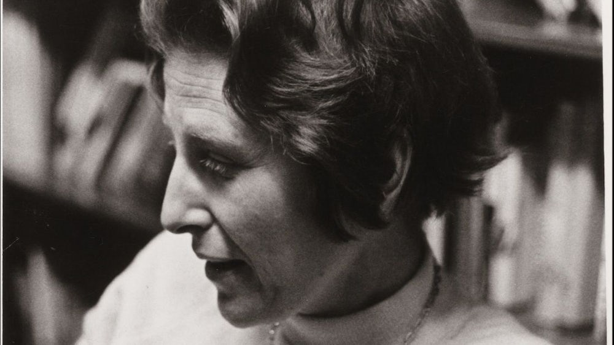
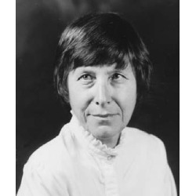
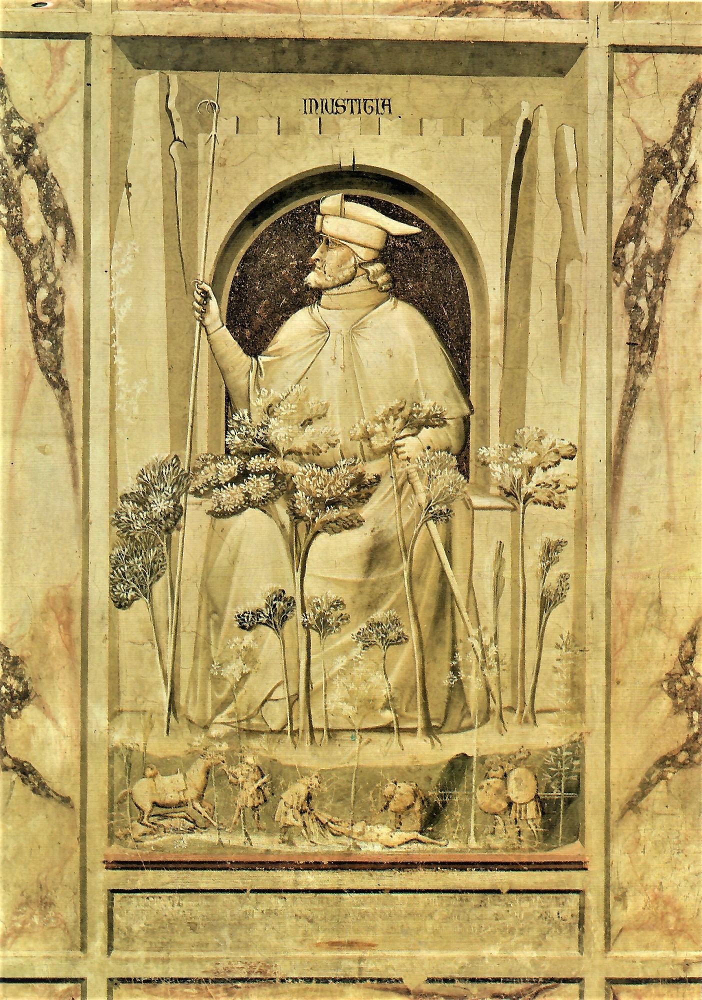

# Judith N. Shklar: Über Ungerechtigkeit (050803)

**Inhalt**

Judith N. Shklar (1928-1992) war eine bedeutende Theoretikerin des politischen Liberalismus und ihr Liberalismus der Furcht ist ein vielzitierter Text in der amerikanischen Debatte. Inzwischen liegt ein Großteil ihres umfangreichen Werkes in deutscher Übersetzung vor.
Über Ungerechtigkeit widmet sich einem unterschätzten politischen und philosophischen Problem und zeigt die Bedeutung der Ungerechtigkeit für den Liberalismus, der eigentlich auf Gerechtigkeitsprinzipien aufbauen sollte..

* Moritz Riemann [riemann@philsem.uni-kiel.de](riemann@philsem.uni-kiel.de) 

* Sprechstundentermine im Sommersemester: **Mittwochs 14-15 Uhr** |  Boschstraße 1, R. 01.001 | **Keine Anmeldung erforderlich** | Nach Absprache auch digital oder telephonisch unter 0431 880 5644

## "Regierungserklärung"

1. Die Teilnahme am Seminar erfordert die vorbereitende, gründliche Lektüre der Texte.

2. Eine regelmäßige und aktive Teilnahme aller Seminarteilnehmenden ist Voraussetzung für ein gelingendes Seminar.
3. Philosophische Seminare leben vom diskursiven Austausch. Nehmt in Euren Diskussionsbeiträgen auf den Text und aufeinander Bezug, lasst einander ausreden und vermeidet lange, abschweifende Exkurse.
4. Meine Sprechsstunde ist offen für alle Anliegen, es ist keine Anmeldung erforderlich.
5. Bevor Ihr eine Email schreibt: Seht im Seminarplan nach, ob die gesuchte Information dort zu finden ist.

## Semesterplan

| **22.04.2025** | **Eröffnung, Organisatorisches, Einleitung** | **Protokoll** |
|------------|------------------------------|---------|
| 29.04.2025 | 1 Der Ungerechtigkeit Gerechtigkeit widerfahren lassen S. 27-49| Nele Guddat |
| 06.05.2025 | 1 Der Ungerechtigkeit Gerechtigkeit widerfahren lassen S. 50-67| Käthe Wieseler |
| 13.05.2025 | 1 Der Ungerechtigkeit Gerechtigkeit widerfahren lassen S. 67-83| Yasmina El Hanafy |
| 20.05.2025 | 2 Unglück und Ungerechtigkeit S. 85-108| Marlon Wieben |
| 27.05.2025 | 2 Unglück und Ungerechtigkeit S. 108-134| Jördis Voß |
| 03.06.2025 | 3 Der Sinn für Ungerechtigkeit S. 135-148| Julian Lehmitz |
| 10.06.2025| 3 Der Sinn für Ungerechtigkeit S. 148-165| Emmelie Bauer |
| 17.06.2025 | 3 Der Sinn für Ungerechtigkeit S. 165-182| Jannik Steenbock |
| 24.06.2025 | 3 Der Sinn für Ungerechtigkeit S. 182-202| Sina Gruber |
| 01.07.2025| Ergänzungstext oder Vertiefungssitzung| -- |
| 08.07.2025| **Abschlussdiskussion** | -- |

**Prüfungszeitraum des aktuellen Semesters**:
14.07. - 26.07.2025

**2. Prüfungszeitraum**:
06.10. - 18.10.2025

**Termine für die Anmeldung zum 1. Prüfungszeitraum (1. PZ)**

* Beginn: Montag 2.06.2025
* Ende: Sonntag 29.06.2025

**Termine für die Anmeldung  zum 2. Prüfungszeitraum (2. PZ)**

* Beginn: 25.08.2025
* Ende: 21.09.2025

## Zuordnung und Prüfungsleistungen

* PHF-phil-BA2 (Geschichte der Philosophie – Gegenwart): **Ergebnisprotokoll** im Umfang von 2-3 Seiten. Das Protokoll soll die wesentlichen Inhalte einer Seminarssitzung ergebnisorientiert und systematisch zusammenfassen. Die Anmeldung zum Protokoll erfolgt zu Beginn der Sitzung. Es ist bis Freitag, 12 Uhr nach der protokollierten Sitzung im OLAT-Teilnehmerordner hochzuladen und dient damit der Rekapitulation zu Beginn der folgenden Sitzung. Beachten Sie die Handreichung zum Erstellen eines Protokolls. Das Protokoll muss am Beginn der folgenden Sitzung kurz (5 Minuten) vorgestellt werden.

* PHF-phil-BA4 (Einführung in die praktische Philosophie): **Take-Home-Klausur** im Umfang von 5-6 Seiten. Die Aufgabenstellung erfolgt in der letzten Sitzung. Abgabe: 31.08.2025

* PHF-phil-BA6 (Praktische Philosophie II – Vertiefung): **Hausarbeit** im Umfang von 10 Textseiten. Individuelle und eigenständige Themenfindung aus dem Themenbereich des Seminars. Ein persönliches Gespräch mit dem Dozenten (Sprechstunde) zur Vorbereitung ist Voraussetzung für die Annahme der Arbeit. Abgabe: 31.08.2025

* PHF-phil-WP (Philosophische Reflexion und ethische Urteilskraft): **Essay** im Umfang von 5-7 Textseiten. Individuelle und eigenständige Themenfindung aus dem Themenbereich des Seminars. Ein persönliches Gespräch mit dem Dozenten (Sprechstunde) zur Vorbereitung ist Voraussetzung für die Annahme der Arbeit. Abgabe: 31.08.2025

Beachten Sie die Handreichung zum wissenschaftlichen Arbeiten im Fach Philosophie. Jedes Referat, jede Hausarbeit und jeder Essay sind im Vorfeld in der Sprechstunde abzustimmen. Der Abgabetermin für die schriftlichen Prüfungsleistungen ist der  **31.08.2025**. Die Abgabe von THK, Essays und Hausarbeiten erfolgt als Ausdruck, mit Deckblatt und unterschriebener Eigenständigkeitserklärung an der Hauptpforte oder im Briefkasten für Prüfungsleistungen in der LS4. **Eine Abgabe per Email ist nicht ausreichend!**

## Hinweise für das Verfassen von Sitzungsprotokollen

### I. Grundformen und Funktionen

1. Wortprotokoll, Verbalprotokoll – direkte Dokumentation des mündlichen Wortlauts z.B. bei Gerichtsverhandlungen
2. Verlaufsprotokoll, Verhandlungsprotokoll – Protokoll des Gesprächsprozesses. Wie kam es zu Beschlüssen oder Ergebnissen? Wie lauteten die Argumente?
3. Ergebnisprotokoll, Beschlussprotokoll – Fokus auf Ergebnisse. Keine Dokumentation des Gesprächsprozesses.
4. Das wissenschaftliche Protokoll – Anteile des Verlauf- und Ergebnisprotokolls. Schriftliche und systematische Wiedergabe diskursiv erarbeiteten Wissens, die eine gemeinsame Wissensbasis schafft. Funktionen: Dokumentation und Aufbereitung des Wissens, Literaturgrundlage, Kontrolle des Wissensstandes, Üben wissenschaftlichen Formulierens

### II. (Sprachliche) Gestaltung

1. Der Protokollkopf: Name der Hochschule, Institut, Seminartyp, Seminarleitung, Protokollant:in, Semester, Datum.

2. Der Protokolltext: 

    * Der Text ist im Präsens und Indikativ zu verfassen. Bei Bezügen auf den Seminarverlauf - also was eine Person sagte - wird Präteritum gewählt. 
    * Das Protokoll ist in ganzen Sätzen (nicht in Stichpunkten) zu formulieren. 
    * Ergebnisse sollen dargestellt werden, allerdings auch deren diskursiver Zusammenhang berücksichtigt werden. Die namentliche Nennung von Sprecher*innen ist nicht angebracht. 
    * Besonders wichtige Aspekte können markiert oder hervorgehoben werden. Auch sollte das Protokoll sinnvoll durch Überschriften und Zwischenüberschriften (Thema und Unterthemen der Sitzung) strukturiert werden. 
    * Übliche Länge sind zwei bis drei DIN-A 4-Seiten.

3. Der Anhang: Bibliographie der Literatur der Seminarsitzung / Folien auf die Bezug genommen wurde.

4. Textformat: Serifenfont (z.B. Times New Roman) 12pt, Fußnoten 10pt., Zeilenabstand 1,5, Blocksatz, Seitenränder 3cm links, 3cm rechts

### III. Herausforderungen

* Balance zwischen diskursivem Verlauf und Ergebnissen -> Herausarbeitung der (zentralen) Ergebnisse.
* Balance zwischen sprachlicher Verknappung/Abstraktion und Wiedergabe der Beiträge. Bitte keine Umgangssprache verwenden. Auf korrekte Fachlexik achten.
* Das Protokoll vor der Abgabe Korrektur lesen (lassen).
* Formal: Protokollkopf einfügen, Gliedern und Strukturieren, Literaturangaben nicht vergessen, Markierungen einheitlich verwenden. (siehe Checkliste)

### IV. Fünf Schritte bei der Erstellung des Protokolls

1. Vorbereitung. Die zu protokollierende Sitzung sollte gut vorbereitet sein.

2. Rezeption der Seminarsitzung. Die anspruchsvolle Aufgabe, Inhalte zu komprimieren und zu strukturieren ist durch eine Tonaufnahme nicht bewältigt, sondern nur vertagt. Außerdem erfordert die Aufnahme das Einverständis des gesamten Plenums. Hören Sie gut zu und seien Sie gnädig mit sich, wenn Sie nicht die vollen 90 Minuten jeden Satz verstehen.

3. Mitschrift während der Sitzung. Wichtige Inhalte müssen dokumentiert werden – gern auch in Stichpunkten oder unter Verwendung von Symbolen und Verweisen. Es ist nicht leicht zu entscheiden, was wichtig und was weniger wichtig ist. Hier hilft es Ihnen, wenn Sie exzellent auf die Seminarsitzung vorbereitet sind. Achten Sie auf folgende Aspekte:

    * Quantität der Besprechungsdauer – Wie lange wurde ein Aspekt besprochen?
    * Top-down denken. Lässt sich die Sitzung in Themenclustern beschreiben? Wie lässt sich eine Struktur herstellen?
    * Gesamtdiskurs aufzeigen. Welche Aspekte vergangener Sitzungen wurden aufgegriffen?
    * Bilanz ziehen. Offene Fragen nennen.

4. Komprimieren und Reproduzieren. Es bietet sich an, die Mitschrift so schnell wie möglich zu bearbeiten, da die Inhalte dann noch frisch erinnert werden. Ergänzen Sie nun aus dem Gedächtnis oder aus Ihren Materialien wichtige Aspekte ihrer Mitschrift und bringen Sie die Inhalte in eine Struktur (die von der Chronologie des Seminars abweichen kann).

5. Erstellen des Protokolls. Die Stichpunkte und Notizen müssen nun in ganze Sätze und eine kohärente Form gebracht werden. Möglicherweise wird der Text auch nochmals umstrukturiert. Der fertige, korrigierte Text kann auch nochmal anhand der Funktionen des Protokolls überprüft werden. Kann eine fremde Person den Sitzungsverlauf und -inhalte nachvollziehen?

Quelle: Kirsten Schindler: Klausur, Protokoll, Essay. Kleine Texte optimal verfassen, Paderborn 2011.

### V. Checkliste vor der Abgabe

 1. Hat Ihr Protokoll einen Kopf?
 2. Ist Ihr Text einheitlich formatiert, im Blocksatz und unter Berücksichtigung der Seitenränder? Stimmen die Seitenumbrüche? Haben Sie Seitenzahlen angegeben?
 3. Haben Sie die Textgrundlage der Sitzung und weitere Quellen einheitlich und eindeutig bibliographisch nachgewiesen?
 4. Besteht Ihr Text aus ganzen und klar verständlichen Sätzen?
 5. Haben Sie Orthographie und Grammatik korrekturgelesen? Haben Sie Fremdwörter und Fachbegriffe nachgeschlagen und deren korrekte Schreibweise überprüft?
 6. Haben Sie die Sitzungsinhalte gegliedert?
 7. Ist Ihr Text ergebnisorientiert verfasst?
 8. Lassen sich die wichtigsten Inhalte der Sitzung anhand Ihres Textes nachvollziehen? Stellen Sie sich vor, Sie müssten einer Kommiliton:in berichten, die bei der Sitzung fehlte.
 9. Bei digitaler Abgabe: Haben Sie Ihr Dokument als .pdf exportiert?
10. Haben Sie alle Punkte der Checkliste berücksichtigt?
11. Haben Sie Ihr Protokoll auf OLAT in den Abgabeordner geladen?

### VI. Vorstellung des Protokolls in der nächsten Sitzung

* Bereiten Sie Ihr Protokoll so vor, dass Sie zu Beginn der darauffolgenden Sitzung in 5 Minuten die Inhalte der protokollierten Sitzung für die Seminarteilnehmenden zusammenfassen können.

## Der Essay als Prüfungsart in den Bachelor- und Masterstudiengängen Philosophie

### 1. Der philosophische Essay

Mit dem Essay als Prüfungsform stellt sich das Philosophische Seminar der Kieler Universität in eine philosophische Tradition, die in dieser literarischen Form die eigenständige Auseinandersetzung mit
einer Frage und These wagt und einen eigenen Gedanken entfaltet. Der Essay (von frz. *essai*: „Versuch“ >
lat. *exagium*, dt. „wägen“, „Gewicht“) ist ein prägnanter Aufsatz über ein philosophisches Problem, eine
kontrovers diskutierte Fragestellung oder These. Im Unterschied zu einer Hausarbeit, in der eine
sachorientierte und systematische Behandlung eines Themas erwartet wird, kommt es beim Essayschreiben
darauf an, das jeweilige Thema in einem größeren Zusammenhang zu ‚erwägen‘, d.h. zu erörtern, um zu einer eigenen Position zu finden und deutlich Stellung zu beziehen. Der Essay erlaubt stilistisch eine größere Freiheit als die wissenschaftliche Hausarbeit, jedoch handelt es sich nicht um eine persönliche Meinungsäußerung, sondern um eine argumentativ begründete Auseinandersetzung.

Die Tradition des philosophischen Essays geht auf die *Essais* von Michel de Montaigne (1533-1592) zurück und betont die eigene Denkbewegung und das erforschende Suchen eines Standpunktes. Mit der essayistischen Form ist eine besondere Form des Philosophierens verbunden, deren Fokus weniger auf der systematischen Auseinandersetzung liegt, sondern vielmehr in der Darstellung der Denkbewegung und Entfaltung eines Gedankens selbst. Mit Francis Bacon (1561-1626), der das Wort von Montaigne übernommen und ins Englische übertragen hat, wird *Essay* zur Gattungsbezeichnung nicht nur philosophischer, sondern auch literarischer Schriften. Beide Autoren gelten als ´Ahnväter´ der philosophischen Essayistik.

Die semantische Erkundung von *essai/essaier* gibt erste Hinweise auf die Unmittelbarkeit und Erfahrungsorientiertheit der essayistischen Denk- und Schreibweise: Wer essayistisch denkt und schreibt, fängt bei sich, d.h. den eigenen Erfahrungen mit der Welt und mit sich selbst an; sie/er unterzieht dabei die eigenen Sichtweisen, Erfahrungen, Urteile, aber auch das, was an Sichtweisen, Erfahrungen, Urteilen anderer jeweils begegnet, einer denkenden Prüfung oder Erwägung. Wenn es sich bei dem Geschriebenen noch dazu um Versuche handelt, so sind die damit verbundenen Wissens-, Erkenntnis- oder Wahrheitsansprüche anscheinend deutlich herabgestimmt. Zugleich bedeutet die essayistische Denkweise aber auch die Erprobung einer Perspektive auf eine bestimmte Sache (seien es Dinge, Sachverhalte/Phänomene, Situationen, Ereignisse), um sie zu erschließen und zu beurteilen.

Eine Hochzeit der philosophischen Essayistik lag in der europäischen Aufklärung des 18. Jahrhunderts. Die Zeit der kritischen Emanzipation von tradierten Herrschaftsverhältnissen hat namhaften Essayisten wie Voltaire in Frankreich, David Hume in England und Gotthold Ephraim Lessing in Deutschland hervorgebracht.

 
Das Essayschreiben erfordert in besonderer Weise kritisches Selbstdenken und die Entwicklung einer eigenständigen Argumentation. Auch wenn die Rückbeziehung auf persönliche bzw. alltägliche Erfahrungen dabei ein wesentlicher Bestandteil der Essayistik ist, **so liegt im Philosophiestudium der Akzent beim Essayschreiben doch deutlich auf der gedanklichen Auseinandersetzung mit einer philosophischen Problemstellung/Kontroverse oder einer philosophischen Position oder einem philosophischen Begriff.** In diesem Kontext kommt es darauf an, sich philosophische Texte methodisch erschließen zu können, um sie angemessen zu verstehen und auszulegen. Mit Hans Georg Gadamer lässt sich der Vorgang des Verstehens als ein Bemühen beschreiben, mit dem Text ´ins Gespräch zu kommen´, d.h. den historischen Horizont des Textes mit dem eigenen „Verstehenshorizont der Gegenwart“, seinen impliziten Maßstäben und legitimen Vorurteilen zu „verschmelzen“.[^1] Eine gute Vorbereitung für diese **hermeneutische Herangehensweise beim Essayschreiben** ist es, sich vor der Lektüre die eigenen Erwartungen an den Text bzw. an das Thema und das eigene Vorverständnis zu vergegenwärtigen.[^2] Wie bei einem Gespräch mit einem unbekannten Menschen, kann dies dazu beitragen, das Gefühl der Fremdheit zu überwinden und dem Gelesenen gegenüber aufgeschlossen zu bleiben – also: aufmerksam ´zuzuhören´. 

[^1]: H.-G. Gadamer: *Wahrheit und Methode. Grundzüge einer philosophischen Hermeneutik.* Tübingen 1960. 6. Aufl. 1990. S.289f. 

[^2]: Vgl. Thomas Rentsch/Johannes Rohbeck: *Essays schreiben – aber mit Methode.* In: Jahrbuch für Didaktik der Philosophie und Ethik 8 (2007). S. 75-81. hier S.78f.

**Literaturhinweise**

Montaigne, Michel de: *Essais*. Übers. v. Hans Stilett. Frankfurt a.M. 2001.

Bacon, Francis: *Essays oder praktische und moralische Ratschläge*. Übers. v.  Elisabeth Schücking. Hrsg. v. Levin Schücking. Stuttgart 2011.

Konersmann, Ralf: *Essay*. in: Ders.: Wörterbuch der Unruhe. Frankfurt a. M. 2017. S.49-55.

Černy, Lothar: *Essay*, in: Historisches Wörterbuch der Philosophie. Hrsg. v. Joachim Ritter, Karlfried Gründer und Gottfried Gabriel. Basel 1971-2007. Bd. 2, Sp.746-749.

Schärf, Christian: *Geschichte des Essays. Von Montaigne bis Adorno.* Göttingen 1999.

### 2. Der Essay als Prüfungsart in den Bachelor- und Masterstudiengängen Philosophie

Der Essay kann in den BA-Wahlpflichtmodulen BA7 und BA8 als eine unter vier Prüfungsarten gewählt werden (Umfang: ca. 10 Seiten); im Modul BA9 ist er neben einer Hausarbeit als weitere Prüfungsart vorgeschrieben. – In den Masterstudiengängen Philosophie ist der Essay verpflichtende Prüfungsart in den Modulen MAA1 bzw. MAE2. 
Die Form des Essays als Prüfungsleistung ist offener als bei einer Hausarbeit. Zur Form gehören die Zitation und eine Bibliographie, wie es auch die wissenschaftliche Hausarbeit fordert. Jedoch sind strenge Strukturierungen mit einem Inhaltsverzeichnis und einer Kapitelstruktur nicht erforderlich. Selbstverständlich gehört zur Prüfungsleistung des Essays ebenso ein Titelblatt wie die aktuelle Eigenständigkeitserklärung. Die offenere Form liegt in größerer sprachlicher und stilistischer Freiheit. Die eigene Perspektive auf eine philosophische Frage oder einen philosophischen Gedanken darf ausgeführt werden, ohne dabei reine Meinungsäußerung zu sein. Es darf mit Beispielen zur Veranschaulichung und Sprachbildern, Metaphern, Fragen gearbeitet werden. Dabei sollte jedoch eine erkennbare Ordnung der Gedanken, d.h. nachvollziehbare Gedankengänge und die erforderliche logische Konsistenz nicht vernachlässigt werden. Ziel ist es einen Standpunkt zu er- und begründen und eine kritische Reflexion eines philosophischen Gegenstandes vorzunehmen.
Es bestehen verschiedene Möglichkeiten, einen Essay zu verfassen. Jonas Pfister[^3] unterscheidet drei Formen des studentischen Essays: 1) den *kritischen* Essay, der eine kritische Prüfung einer philosophischen These vornimmt; 2) den *problemlösenden* Essay, der die Lösung eines philosophischen Problems versucht, und 3) den *urteilenden* Essay, der die Entscheidung eines philosophischen Streits versucht. Jay F. Rosenberg[^4] erläutert wie in einem Essay eine *begründete Verteidigung einer These* erfolgt.

**Achtung:** Das Thema des Essays ist in der Regel im Rahmen des Seminarhorizonts frei gewählt, aber stets mit den Dozent*innen abzustimmen! Das gleiche gilt für etwaige spezifischen Anforderungen des Essays als Prüfungsleistung, die von der jeweiligen Lehrperson festgelegt werden. Diese können von den hier formulierten Anforderungen abweichen.

**Hinweise zum Essayschreiben** s. Lektion zum Essay im **E-Learning Kurs** *Wissenschaftliches Arbeiten im Fach Philosophie*, 3.6/Lektion 13:

[^3]: Vgl. Pfister, Jonas: *Werkzeuge des Philosophierens*. S.246-250.

[^4]: Vgl. Rosenberg, Jay F.: *Philosophieren. Ein Handbuch für Anfänger*. Frankfurt a. M. 2009. S.81.

## Hinweise zum Verfassen von Hausarbeiten

[Ausführliche Hinweise hier](https://liascript.github.io/course/?https://raw.githubusercontent.com/Philosophie-Lehre-Moritz-Riemann/Hausarbeit/refs/heads/main/Hausarbeit_main.md)

## 1. Sitzung am 22.04.2025

**Name:** Judith Nisse Shklar  

**Geboren:** 24. September 1928 in Riga, Lettland 

**Gestorben:** 17. September 1992 in Cambridge, Massachusetts, USA  

**Beruf:** Politikwissenschaftlerin und politische Theoretikerin  

Judith Shklar gilt als eine der bedeutendsten liberalen Theoretikerinnen des 20. Jahrhunderts. Ihre Arbeiten haben bis heute Einfluss auf Debatten über politische Ethik, Machtbegrenzung und die Rolle von Freiheit in einer liberalen Gesellschaft.

## Leben

**Herkunft und Flucht:** 
Geboren in eine deutschsprachige jüdische Familie, floh sie 1939 mit ihrer Familie vor den Nationalsozialisten und Sowjets über die Transsibirische Eisenbahn nach Kanada.  

**Bildung:** 
Studium der Politikwissenschaft an der McGill University in Montreal; Promotion an der Harvard University (1955). 

**Karriere:**
Erste Frau auf einer Festanstellung im Fachbereich Politische Wissenschaften an der Harvard University. Sie lehrte dort bis zu ihrem Tod und wurde 1980 zur "John Cowles Professor of Goverment" ernannt.

[**Storymap zu Shklars Flucht und Vita**](https://storymaps.arcgis.com/stories/38af7d5862a84180a00f70f34981df5b)

Elaine Ringeloth, Fleming Jensen

## Philosophisches Denken

**Wichtige Werke**:

- *After Utopia: The Decline of Political Faith* (1957)  
- *Ordinary Vices* (*Ganz normale Laster*, 1984)  
- *The Liberalism of Fear* (*Der Liberalismus der Furcht*, 1989)  
- *Faces of Injustice* (*Über Ungerechtigkeit*, 1990)

**Der Liberalismus der Furcht (1989)**
Dieser kurze Text ist ihr bekanntester und prägendster. Es formuliert eine liberale Theorie, die darauf abzielt, Grausamkeit und Machtmissbrauch zu verhindern. Shklar argumentiert, dass der Liberalismus vor allem die Freiheit sichern sollte, ohne Furcht Entscheidungen treffen zu können. Sie befürwortet eine konstitutionelle, repräsentative und menschenrechtlich-liberale Demokratie, die Macht begrenzt und verteilt.

**Ganz normale Laster (1984)**

In diesem Buch untersucht Shklar alltägliche moralische Schwächen wie Grausamkeit, Heuchelei und Feigheit. Sie stellt Grausamkeit als das größte Übel (*summum malum*) dar und verbindet dies mit ihrer liberalen Theorie. Das Werk bietet eine tiefgehende Reflexion über die moralischen Grundlagen des politischen Handelns.

**Über Ungerechtigkeit (1990)**

In diesem Werk kritisiert Shklar die philosophische Vernachlässigung des Konzepts der Ungerechtigkeit zugunsten von Gerechtigkeitstheorien. Sie analysiert verschiedene Formen von Ungerechtigkeit (z. B. passive und aktive Ungerechtigkeit) und betont deren zentrale Bedeutung für politische und soziale Theorie.

**After Utopia: The Decline of Political Faith (1957)**

Dieses frühe Werk kritisiert utopisches Denken in der politischen Theorie und plädiert für eine realistische Betrachtung politischer Möglichkeiten. Es zeigt Shklars Skepsis gegenüber Ideologien, die auf idealisierten Zukunftsvisionen basieren.

**Essays über Hannah Arendt**

Ihre kritischen Texte über Hannah Arendt beleuchten Unterschiede in den Denkansätzen der beiden Philosophinnen, insbesondere in Bezug auf Exil, Freiheit und politische Romantik. Diese Essays sind besonders relevant für das Verständnis von Shklars Position im Vergleich zu anderen großen politischen Theoretikern[2].
Diese Werke prägen bis heute Debatten über Liberalismus, Gerechtigkeit und politische Ethik und machen Judith Shklar zu einer der bedeutendsten Denkerinnen des 20. Jahrhunderts.

## Zum Nachforschen

### Ausgewählte Sekundärliteratur

- Abbey, Ruth, „Putting Cruelty First: Exploring Judith Shklar's Liberalism of Fear for Animal Ethics", in: Politics and Animals 2, Nr. 1 (2016), S. 25-36.

- Allen, Jonathan: The Place of Negative Morality in Political Theory, in: Political Theory 29(2001)3, S. 337-363.

-	Bajohr, Hannes und Trimçev, Rieke: [Judith N. Shklar. Leben – Werk – Gegenwart](https://www.beck-shop.de/bajohr-trimev-ad-judith-n-shklar/product/33569982?srsltid=AfmBOooBwTjI0ZacYJTX_RDvWK6Ett0u1E_N57BvUAvT7yYH9MHVY1wX).

- Bajohr, Hannes, „Harmonie und Widerspruch. Mit Judith N. Shklar gegen die ‚Ideologie der Einigkeit*", Hendrikje Schauer und Marcel Lepper (Hg.), Distanzierung und Engagement. Wie politisch sind die Geisteswissenschaften? (Stuttgart: Works & Nights 2018), S.75-85.

- Bajohr, Hannes, „Judith N. Shklar über die Quellen liberaler Normativität", in: Karsten Fischer und Sebastian Huhnholz (Hg.), Liberalismus. Traditionsbestände und Gegenwartskontroversen (Baden-Baden: Nomos 2019), S.71-98.

- Bajohr, Hannes, „Strategies of Authority: The Distorting Think-Piece and the Case of Judith Shklar", in: [Journal of the History of Ideas](https://www.jhiblog.org/2020/07/08/strategies-of-authority-the-distorting-think-piece-and-the-case-of-judith-shklar/) (Blog), 2020.

- Benhabib, Seyla: Judith Shklar's Dystopic Liberalism, *Social Research*, Vol. 61, No. 2 (SUMMER 1994), pp. 477-488.  || Oder auf deutsch: Benhabib, Seyla, „Judith Shklars dystopischer Liberalismus", , in: Judith N. Shklar, Der Liberalismus der Furcht, hg. und übers. Hannes Bajohr (Berlin: Matthes & Seitz 2013), S.67-86.

- Betsky, Celia B., [„Judith Shklar. The Metics' Metic"](https://www.thecrimson.com/article/1972/3/31 judith-shklar-the-metics-metic-pbcbommenting/), The Harvard Crimson, 31. März 1972.

- Blättler, Sidonia: Judith Shklar. Aufklarung ohne Glücksversprechen, in: Polis 53(2011), S. 14-30.

- Davis, Natalie Z., Brief an Judith N. Shklar, 3. Dezember 1982, Papers of Judith N. Shklar, Series: Correspon-dence, 1959-1992, HUGFP 118, Box2.

- Douglass, Robin, ,Cruelty, Injustice, and the Liberalism of Fear", in: Political Theory 51, Nr. 5 (2023), S. 790-813.

- Dunn, John, „Hope over Fear. Judith Shklar as Political Educator", in: Bernard Yack (Hg.), Liberalism without Illusions. Essays on Liberal Theory and the Political Vision of Judith N. Shklar (Chicago: The University of Chicago Press 1996), S. 45-54.

- Flathman, Richard E.: Fraternal, but not Always Sisterly Twins. Negativity and Positivity in Liberal Theory, in: Social Research 66(1999)4, S. 1137-1142.

- Fiser, Webb S., [Rezension zu: Judith N. Shklar, After Utopia], in: Ethics 68, no. 3 [1958), S. 217-219.

- Fives, Allyn: [The unnoticed monism of Judith Shklar’s liberalism of fear](https://journals.sagepub.com/doi/full/10.1177/0191453719849717)- - Allyn Fives: [The unnoticed monism of Judith Shklar’s liberalism of fear](https://journals.sagepub.com/doi/full/10.1177/0191453719849717)

- Forrester, Katrina, „Hope and Memory in the Thought of Judith Shklar", in: Modern Intellectual History 8, Nr. 3 [2011), S. 159.

- Hall, Edward, „Ideological Self-Consciousness: Judith Shklar on Legalism, Liberalism, and the Purposes of Political Theory", in: Social Philosophy & Policy 2024;41(1):105-125. doi:10.1017/S0265052524000347.

- Hess (Hg.), Between Utopia and Realism. The Political Thought of Judith N. Shklar (Philadelphia: University of Pennsylvania Press 2019), S. 239-252.

- Hess, Andreas, The Political Theory of Judith N. Shklar. Exile from Exile (New York: Palgrave Macmillan 2014).

- Hoffmann, Stanley: Judith Shklar as Political Thinker, *Political Theory*, Vol. 21, No. 2 (May, 1993), pp. 172-180.

- Honneth, Axel, „Die Historizität von Furcht und Verletzung. Sozialdemokratische Züge im Denken von Judith Shklar", in: ders., Vivisektionen eines Zeitalters. Porträts zur Ideengeschichte des 20. Jahrhunderts (Berlin: Suhrkamp 2014), S. 248-262.

- Ignatieff, Michael, [Rezension zu: Judith N. Shklar, Ordinary Vices], in: The Political Quarterly 56, Nr. 3 [1985), S. 309-312.

- Levinson, Sanford, „Is Liberal Nationalism an Oxymoron? An Essay for Judith Shklar" S. 626-645.

- Memorial Tributes to Judith Nisse Shklar, 1928-1992. A Service in Memory of Judith Nisse Shklar, Cowles Professor of Government, Harvard University, 24 September 1928-17 September 1992. The Memorial Church, Harvard University, Friday, 6 November 1992 (Cambridge, Mass. 1992).

- Misra, Shefali, „Ugly Attachments: Judith Shklar and the Unattractive Face of Solidarity", in: Global Intellectual History 7, Nr. 4 [2022): S. 685-701.

- Moyn, Samuel, „Before - and Beyond - the Liberalism of Fear", in: Samantha Ashenden und Andreas Hess (Hg.), Between Utopia and Realism. The Political Thought of Judith N. Shklar (Philadelphia: University of Pennsylvania Press 2019), S. 24-46.

- Moyn, Samuel, „Judith Shklar über die Philosophie des Völkerstrafrechts", , in: Deutsche Zeitschrift für Philosophie 62, Nr. 4 [2014), S. 683-707.

- Müller, Jan-Werner, Furcht und Freiheit. Für einen anderen Liberalismus (Berlin: Suhrkamp 2019).

- Pickford, Eleanor: [Judith Shklar on the problem of political motivation](https://www.repository.cam.ac.uk/items/cbfac99e-182f-435e-b46e-b25755c0c65f) 

- Sabl, Andrew, „Judith Shklar, Ordinary Vices, in: Jacob T. Levy [Hg.), The Oxford Handbook of Classics in Con-temporary Political Theory [Oxford: Oxford University Press 2019), https://doi.org/10.1093/oxfordhb/9780198717133.013.5.

- Salaverría, Heidi, „Ungeregelte Zweifel und politische Urteilsbildung bei Judith Shklar und Jacques Rancière", in: Deutsche Zeitschrift für Philosophie 62, Nr. 4 [2014), S. 708-726.

- Ulrich, Amadeus, „Furcht und Elend in der Demokratie. Zur Aktualität des politischen Denkens von Judith N. Shklar", , in: Zeitschrift für Politische Theorie 13, Nr. 1-2 [2023), S. 69-89.

- Unrau, Christine, „Judith Shklars Sinn für Veränderung", in: Zeitschrift für Politische Theorie 9, Nr. 2 [2018[2020]), S. 239-251.

- Voigt, Peter, „Skepsis und Sozialdemokratie - Mésalliance oder Zukunftsbündnis? Ein Plädoyer im Anschluss an Judith Shklar", in: Zeitschrift für Politische Theorie 9, Nr. 2 [2018 [2020]), S. 223-238.

- Walzer, Michael, „Über negative Politik", in: Shklar, Der Liberalismus der Furcht, S. 87-105.

- Wolin, Sheldon S., [Rezension zu: Judith N. Shklar, After Utopia], in: Natural Law Forum 5 [1960), S. 163-177.

-	Zeitschrift für Theoretische Philosophie:[Themenheft zur Shklars politischer Philosophie][hhttps://shop.budrich.de/wp-content/uploads/2022/01/1869-3016-2018-2.pdf).

- Rieke Trimçev: [Verbindlichkeitskonflikte und politische Verpflichtung][https://www.ssoar.info/ssoar/bitstream/handle/document/66276/ssoar-zpth-2018-2-trimcev-Verbindlichkeitskonflikte_und_politische_Verpflichtung.pdf?sequence=2&isAllowed=y&lnkname=ssoar-zpth-2018-2-trimcev-Verbindlichkeitskonflikte_und_politische_Verpflichtung.pdf).

### Judith Shklar im Netz [Auswahl)

-	[Die politische Philosophie der Judith N. Shklar - Liberalismus ohne Illusionen][https://www.br.de/mediathek/podcast/radiowissen/die-politische-philosophie-der-judith-n-shklar-liberalismus-ohne-illusionen/1853684).

-	[Judith N. Shklar: „Über Hannah Arendt“. Kritik unter Geistesgrößen][https://www.deutschlandfunkkultur.de/judith-n-shklar-ueber-hannah-arendt-kritik-unter-100.html).

- [Buchkritik von H. Bajohr][https://www.deutschlandfunkkultur.debuchkritik-ad-judith-n-shklar-von-hannes-bajohr-rieke-trimcev-dlf-kultur-6782831d-100.html).

- [Literaturkritik: Nora Ecker - Wir schauen zu gerne weg][https://literaturkritik.de/shklar-ueber-ungerechtigkeit,28533.html).

- [MacArthur Foundation: Judith N. Shklar][https://www.macfound.org/fellows/class-of-march-1984/judith-n-shklar).

- [Seyla Benhabib:Judith Nisse Shklar][https://bpb-us-w2.wpmucdn.com/campuspress.yale.edu/dist/3/949/files/2016/05/Judith-Nisse-Shklar-1928-1992-Proceedings-of-the-APA-1vyo0j1.pdf).

- [Bunk:Judith N. Shklar][https://www.bunkhistory.org/tags/persons/judith-n-shklar).

- [Alexander Cammann[Zeit Online): Judith Shklar. Triumph einer Außenseiterin][https://www.zeit.de/2017/27/judith-nisse-shklar-philosophin-liberalismus-sammelband).

- [Katharina Kaufmann [Theorieblog): Dialog zwischen einer Exilantin und einem Staatsbürger – Lesenotiz zu Judith Shklar über „Verpflichtung, Loyalität, Exil“][https://www.theorieblog.de/index.php/2019/12/dialog-zwischen-einer-exilantin-und-einem-staatsbuerger-lesenotiz-zu-judith-shklar-ueber-verpflichtung-loyalitaet-exil/).

- [Dr. Sandra von Siebenthal:Judith Shklar: Liberalismus der Furcht [Rezension)][https://denkzeiten.com/2023/06/26/judith-shklar-liberalismus-der-furcht/).

- [Wikipedia: Judith Shklar][https://de.wikipedia.org/wiki/Judith_N._Shklar).

- [Michael Knoll [intellectures): Liberalismus und Demokratie führen eine Zweckehe][https://www.intellectures.de/2021/03/29/liberalismus-und-demokratie-fuehren-eine-zweckehe/).

### Podcastsendungen [Auswahl)

-	[Podcast Filosofie: Judith Shklar][https://podcasts.apple.com/de/podcast/judith-shklar/id1451841760?i=1000646349383).

-	[Required Reading from: Liberalism of Fear by Judith Shklar][https://podcasts.apple.com/de/podcast/liberalism-of-fear-by-judith-shklar/id1786599014?i=1000681133134).

-	[SWR. Das Wissen: Die Politologin Judith Shklar][https://podcasts.apple.com/de/podcast/die-politologin-judith-nisse-shklar-wie-demokratien/id104913043?i=1000501341831).

-	[Talking Politics: Shklar on Hypocrisy](https://podcasts.apple.com/de/podcast/shklar-on-hypocrisy/id1508992867?i=1000517869772).
-	

## 2. Sitzung am 29.04.2025

Textgrundlage: 1 -- Der Ungerechtigkeit Gerechtigkeit widerfahren lassen; Gerechtigkeit und Ungerechtigkeit [S. 29ff.); Zweifel an der Gerechtigkeit im Reich der Ungerechtigkeit [S. 36ff.)

## Protokoll von Nele Guddat

In der Sitzung vom 29.04.2025 wurden Auszüge aus Judith N. Shklars Werk „Über
Ungerechtigkeit. Erkundung zu einem moralischen Gefühl“[^1] besprochen. Shklar
kritisiert die Vernachlässigung des Begriffs ‚Ungerechtigkeit’ in Theorie und
Öffentlichkeit und zeigt, dass gerade diese Leerstelle zentrale politische und moralische
Fragen aufwirft.

**Begriffsunterscheidung**

Shklar beginnt mit der Unterscheidung zwischen **Unglück** und **Ungerechtigkeit**.
Ersteres wird als unbeeinflussbares — oft naturgegebenes — Ereignis gesehen.
Beispiele könnten Naturgewalten darstellen. Ungerechtigkeit hingegen besteht, wenn
durch Handeln oder auch Nichthandeln [passive Ungerechtigkeit)[^2] direkter Einfluss auf
eine Situation entsteht, durch welche Leid verursacht wird.[^3] Bereits bei der
Unterscheidung beider Begriffe zeigen sich Grauzonen. So können auch durch den
menschengemachten Klimawandel Naturkatastrophen hervorgerufen werden, die nun
anstatt unter Unglück unter Ungerechtigkeit zählen. Je tiefer man also in die
Begriffsunterscheidungen blickt, umso mehr verschmelzen die Grenzen beider Begriffe.
Shklars zentrale These ist, dass die Grenze zwischen Unglück und Ungerechtigkeit verschwommen und stark abhängig von politischen und normativen Setzungen ist, wodurch die Betrachtung der Begriffe immer im Wandel ist.[^4]

**Opferperspektive**

Das Reich der Ungerechtigkeit ist oft deutlich größer als wir wahrnehmen. Um sie
besser sehen zu können, müssen wir uns von der Täterperspektive lösen und der
Perspektive der Opfer nähern. Denn die Wahrnehmung von Ungerechtigkeit ist oft
subjektiv und nur aus der Opferperspektive vollständig erfahrbar.[^5] Doch auch die
Perspektive der Opfer ist nicht immer korrekt. So sagt Shklar, dass Menschen potentiell
ungerecht handeln können, wenn sie andere anklagen. Denn das Suchen von
Ungerechtigkeit ist eine menschliche Eigenschaft und hört meist auch nicht auf, bevor
ein Schuldiger gefunden wird. Doch es gibt auch Formen der Ungerechtigkeit die
keinen Verursacher haben. Für Opfer ist es jedoch schwer eine Situation ‚nur’ als
Unglück anzunehmen.[^6]

**Vernachlässigung von Ungerechtigkeit**

Bereits wenn man sich den Buchtitel „Über Ungerechtigkeit“[^7] genauer anschaut, so
verpackt Shklar bereits hier ihre Position. Für Shklar steht fest, dass der Begriff
Ungerechtigkeit nicht genug beachtet wird. Philosophie fokussiere sich einseitig auf
Gerechtigkeit.[^8] Ungerechtigkeit wird marginalisiert, sowohl in der Theorie als auch im
öffentlichem Diskurs. Hier liegt auch das konkrete Problem: Ungerechtigkeit wird nicht
genug betrachtet. Im Diskurs wird nur über Gerechtigkeit gesprochen, alles was nicht
gerecht ist, muss ungerecht sein.[^9] Wenn Ungerechtigkeit nur als Abwesenheit von
Gerechtigkeit bestimmt wird, bleibt sie dabei unbestimmt. Diese Bestimmung macht
Ungerechtigkeit zu einem wandelbarem Begriff, da Gerechtigkeit auch immer davon abhängt was ideologisch und gesellschaftlich festgelegt wurde.[^10] In einem Staat würde
Ungerechtigkeit dann herrschen, wenn keine Regeln vorhanden sind, nicht wenn diese
nicht befolgt werden. Doch auch innerhalb einer funktionierenden Rechtsordnung
können Ungerechtigkeiten existieren. Diese sind in das System eingebunden und
akzeptiert, was sie allerdings nicht weniger ungerecht macht. Auch hinter dem Schutz
der Institutionen kann das Recht selbst zur Durchsetzung von Unrecht benutzt werden.[^11]
Wenn wir uns also darauf verlassen, dass Gerechtigkeit durch Rechtsordnungen
produziert wird, verlassen wir den Boden der Moral und folgen blind den Gesetzen
ohne uns um das durch sie produzierte Unrecht zu kümmern.
Doch Ungerechtigkeit und Gerechtigkeit können auch gleichzeitig existieren. Denn
Gerechtigkeit ist im einfachsten Modell ein Ideal, welches in politischen Systemen
angestrebt wird.[^12] Ungerechtigkeit hingegen ist oft eine konkrete Erfahrung.[^13] Beides
schließt sich nicht zwangsläufig aus, sondern existiert in einem Spannungsverhältnis. So
kann ein Staat gerechte Prinzipien vertreten, aber gleichzeitig ungerecht handeln. Nur
durch Gerechtigkeit wird Ungerechtigkeit sichtbar und umgekehrt.
Unrecht wird oft privat empfunden, womit wir eine Grenze zwischen privaten und
gesellschaftlichen Problemen ziehen. Diese Grenze lässt allerdings viele Faktoren aus.[^14]
Auch in der bildenden Kunst sieht Shklar ein Mangel an der Representation von
Unrecht.[^15] Sie unterstellt den bildenden Künsten, sowie der Philosophie eine Art der
Überheblichkeit. Beide Bereiche würden sich nur mit der Gerechtigkeit befassen und
Lösungen für mehr Gerechtigkeit präsentieren, ohne sich mit der Ungerechtigkeit
wirklich zu beschäftigen.[^16] Doch ob die bildende Kunst hier richtig betrachtet wird ist
anfechtbar, da beispielsweise mehrere Jahrhunderte der Kunstgeschichte mit
Gewaltdarstellungen und Darstellungen von Unrecht gefüllt sind.

**Rolle der politischen Theorie**

Ungerechtigkeit darf laut Shklar weder im reinen Modus der Geschichte oder Ethik
betrachtet werden. Im Gegensatz zur Gerechtigkeit können für Ungerechtigkeit keine
allgemeinen ethischen Regeln aufgestellt werden. Doch auch nur der reine
geschichtliche Blick bringt uns nicht weiter, da wir an bereits Geschehenem nichts
ändern können. Das Zusammenspiel aus Ethik und Geschichte, welches sich in der
politischen Theorie wiederfindet, bringt einen guten Mittelweg um sich mit
Ungerechtigkeit auseinanderzusetzen. So können wir Vergangenes reflektieren und
daraus lernen.[^17]

**Schlussreflektion**

Es ist schwer zu bestimmen, was gerecht oder ungerecht ist — besonders, da
Gerechtigkeit oft durch Systeme vorgegeben wird. Ungerechtigkeit ist oft subjektiv,
dadurch aber auch konkreter. Beides kann gleichzeitig existieren, etwa im
Flüchtlingsrecht: Ein Regelwerk zum Schutz marginalisierter Gruppen wird gleichzeitig
zur Ausgrenzung verwendet. Shklar kritisiert genau diese Doppelfunktionen, in der
große Regelwerke Ungerechtigkeit nicht verhindern, sondern mitproduzieren.[^18]

**Literaturverzeichnis**

Judith N. Shklar: Über Ungerechtigkeit. Erkundung zu einem moralischen Gefühl, 1. Auflage, MSB Matthes & Seitz, herausgegeben von Hannes Bajohr, Berlin 2021.

[^1]: Judith N. Shklar: Über Ungerechtigkeit. Erkundung zu einem moralischen Gefühl., 1. Auflage, MSB Matthes & Seitz, herausgegeben von Hannes Bajohr, Berlin 2021.

[^2]: Vgl. ebd. Seite 13-14.

[^3]: Vgl. ebd. Seite 7-8.

[^4]: Judith N. Shklar: Über Ungerechtigkeit. Erkundung zu einem moralischen Gefühl., 1. Auflage, MSB Matthes & Seitz, herausgegeben von Hannes Bajohr, Berlin 2021, vgl. Seite 16-17.

[^5]: Vgl. ebd. Seite 26.

[^6]: Vgl. ebd. Seite 10-11.

[^7]: Judith N. Shklar: Über Ungerechtigkeit. Erkundung zu einem moralischen Gefühl., 1. Auflage, MSB Matthes & Seitz, herausgegeben von Hannes Bajohr, Berlin 2021.

[^8]: Vgl. ebd. Seite 29-30.

[^9]: Vgl. ebd.

[^10]: Judith N. Shklar: Über Ungerechtigkeit. Erkundung zu einem moralischen Gefühl., 1. Auflage, MSB Matthes & Seitz, herausgegeben von Hannes Bajohr, Berlin 2021, vgl. Seite 17.

[^11]: Vgl. ebd. Seite 34-36.

[^12]: Vgl. ebd. Seite 32.

[^13]: Vgl. ebd. Seite 10-11.

[^14]: Vgl. ebd. Seite 16.

[^15]: Vgl. ebd. Seite 29.

[^16]: Vgl. ebd.

[^17]: Judith N. Shklar: Über Ungerechtigkeit. Erkundung zu einem moralischen Gefühl., 1. Auflage, MSB Matthes & Seitz, herausgegeben von Hannes Bajohr, Berlin 2021, vgl. Seite 30.

[^18]: Vgl. ebd. Seite 35-36.

## 3. Sitzung am 06.05.2025

**Textgrundlage:** 

Zweifel an der Gerechtigkeit im Reich der Ungerechtigkeit [S.36ff.)
Wer sind die Opfer der Ungerechtigkeit? [S. 50ff.)
Passive Ungerechtigkeit: Wie man ein schlechter Bürger ist [S. 67ff.)

### Gruppenarbeit

> Bildet vier Gruppen. Analysiert und diskutiert die Euch zugewiesene Textpassage auf die Schlüsselbegriffe hin. Bereitet die Ergebnisse so auf, dass Ihr sie im Plenum vorstellen könnt und benennt dazu zwei Sprecher:innen. Ihr habt 20 Minuten Zeit.
> 
> Gruppe 1: Zweifel an der Gerechtigkeit im Reich der Ungerechtigkeit: Wie versteht und erklärt Shklar den Begriff Skeptizismus in Bezug auf Gerechtigkeit?
> 
> Gruppe 2: Zweifel an der Gerechtigkeit im Reich der Ungerechtigkeit: Warum ist Gerechtigkeit für Platon ein Erkenntnisproblem?
> 
> Gruppe 3: Wer sind die Opfer der Ungerechtigkeit?: Wie beschreibt Shklar die Täterperspektive der Gerechtigkeitstheorie?
> 
> Gruppe 4: Wer sind die Opfer der Ungerechtigkeit?: Wie beschreibt Shklar die Opferperspektive der Gerechtigkeitstheorie?

### Protokoll von Käthe-Marie Wieseler

In der Sitzung vom 06.05.2025 wurde sich mit vier großen Fragestellungen beschäftigt, die
inhaltlich auf zwei Schwerpunkte des Buches Über Ungerechtigkeit von Judith N. Shklar
zurückgehen. Zum einen lag der Fokus auf dem Begriff des Skeptizismus und dessen
Bedeutung im Kontext von Gerechtigkeit und politischem Denken. Zum anderen haben wir
untersucht, wer als Opfer von Ungerechtigkeit gilt und wie diese Opferrollen gesellschaftlich
konstruiert und wahrgenommen werden.

**Zweifel an der Gerechtigkeit im Reich der Ungerechtigkeit**

Shklar versteht den Begriff Skeptizismus in Bezug auf Gerechtigkeit als einen Zweifel an der
Gültigkeit und Wirksamkeit des herkömmlichen Gerechtigkeitsmodells. Skeptizismus äußert
sich in diesem Fall insbesondere im politischen und erkenntnistheoretischen Sinne. Bei Shklar
nehmen die Skeptiker ihren Ausgang von der Selbstsicherheit und Gerissenheit der
gewöhnlichen, institutionellen Gerechtigkeit und zudem aus der Erschütterung über die Übel
der Zeit.[^1] Hierbei handelt es sich um eine kritische Haltung gegenüber gesellschaftlich
anerkannten Überzeugungen, insbesondere im Hinblick auf rechtliche Legalität und
moralische Normen. Ein wesentlicher Punkt ist, dass der Skeptizismus an die Selbstsicherheit
stößt. Das Gegenstück zu dem Skeptizismus ist Akzeptanz. Die Skeptiker akzeptieren nicht
einfach die bestehenden Systeme, sondern hinterfragen, ob das, was als gerecht gilt, tatsächlich gerecht ist oder nur als solches erscheint. Erst wenn man Gewissheit erlangt, kann
man dogmatisch sein.

"Es mag wohl sein, dass ich diese Art Skeptiker vom gewöhnlichen Verständnis immer weiter
entfernen, weil die Übel der Zeit sie erschüttern". Zeitgemäß geht es um Ungerechtigkeiten in
der Zeit von Platon und Montaigne.[^2] Platon litt unter der Umstrukturierung Roms zur
christlichen Machtübernahme und Montaigne war mitten in einem Französischen Bürgerkrieg
im 16.Jhd. Von dieser Zeit wird gesprochen, weil die Moralphilosophie dort in der Zeit in
Trümmern lag. In diesem Zusammenhang gibt es immer ein Zweifeln oder Verzweifeln.

Skeptiker sagen nicht die konstitutionelle Sichtweise sei schlecht.[^3] Meist ist es eine politische
Entscheidung welche man als ungerecht ansieht. Ist politische Theorie der Skeptizismus?
Nein, aber politische Theorie braucht ein gewisses Maß an skeptischen Fragen.

Skeptiker sind aus Krisenzeiten hervorgegangen und haben sich durch diese Krisen
entwickelt. Wir versuchen immer skeptisch zu sein in jeder Theorie.

**Warum ist Gerechtigkeit Für Platon einer Erkenntnisproblem?**

Platon verwirft das herkömmliche Modell von Gerechtigkeit. Er ist nicht der Auffassung, dass
man durch Beobachtung der gesellschaftlichen Realität zu Erkenntnis von Gerechtigkeit
gelangen kann, denn diese Realität sei durch Ungerechtigkeit geprägt. Somit sollten die
Menschen nur nach Notwendigkeit handeln, sich von festen Regeln lösen und nicht nach dem
richten, was wir uns wünschen. Ein Hinblick auf eine gerechte Ordnung wird von Platon nicht
gegeben. Es darf nur so weit gehen, dass es den Menschen gut geht, sie aber nicht anfangen,
andere Menschen auszunutzen. Somit gibt es bei Platon weniger Wahl und
Entscheidungsfreiheit und ist eine relativ monarchisch obligatorische Regelung. Da wir nicht
wissen können, was Gerechtigkeit ist, können wir auch nicht, wenn wir vor Entscheidungen
stehen, gerecht handeln.

**Wer sind die Opfer der Ungerechtigkeit? Die Täterperspektive der
Gerechtigkeitstheorie**

Oftmals ist man sich selbst gegenüber ungerecht und gibt sich Schuld für Dinge, die man
nicht getan hat als eine Art selbst Bestrafung.[^4] Oft bedarf es einen Außenstehenden, um die Täter und Opferrolle bestimmen zu können.[^5] Um aber unparteiisch zu sein, dürfte man nicht
dem Täter im Ganzen betrachten, sondern nur seine Tat[^6]. Aristoteles Standpunkt ist es, dass
sich ungerechte selbst schaden, indem sie ihren Charakter mit Habgier verderben.[^7] Wenn
Habgier als einziges Motiv feststeht, führt es dazu, dass Großzügigkeit ebenso ungerecht ist.
Deswegen bedeutet eine ungerechte Politik, auch den Verlust von Hemmung beim kollektiven
Handeln.[^8] Oftmals ist der Unterschied für eine Außenstehende Person nur das Verständnis der
Ungerechtigkeit. Ein Opfer zu charakterisieren ist für Shklar unmöglich,[^9] denn ein Opfer kann
auch morgen zu einem Täter werden. Ein Täter zu sein hat einen natürlichen Ursprung, denn
er hat einen Charakter, der zu dem geformt wurde, was er heute ist.

**Wer sind die Opfer der Ungerechtigkeit? Die Opferperspektive der
Gerechtigkeitstheorie**

Als Opfer geht man in einen Rückzug, bei dem man sich aus der Opferrolle zurückziehen
kann und möchte. Opfer müssen eine Art Selbstidentifikation besitzen und es sich selbst
eingestehen.[^10] Durch Werte und Normen, die einem beigebracht werden, will man sich häufig
aus der Opferrolle zurücknehmen. Die aktive Annahme der Opferrolle ist somit komplex: sie
kann als notwendig und legitim angesehen werden, um Unrecht sichtbar zu machen, aber auch
als problematisch, wenn sie mit gesellschaftlicher, schwäche oder Passivität assoziiert wird.

Ein zentraler Gedanke ist hier auch die Vorstellung, dass die Person die Unrecht tut, am Ende
schlechter dran ist als diejenige, die das Unrecht er leidet. Die Sichtweise dreht die gängige
Perspektive um: nicht das Opfer, sondern der Täter wird als der eigentlich verletzte angesehen
nicht auf der Ebene des psychisch physischen Schadens, sondern im Hinblick auf die
moralische Integrität und die seelische Verfassung. Dies ist ein Erkenntnistheoretisches
Problem und wird als Innersubjektive Opferumkehr verstanden.[^11]

**Literatur**

Judith N. Shklar: Über Ungerechtigkeit. Erkundung zu einem moralischen Gefühl, 1. Auflage, MSB Matthes&Seitz, herausgegeben von Hannes Bajohr, Berlin 2021.

[^1]: Vgl. S. 36.
[^2]: Vgl. S. 36.
[^3]: Vgl. S. 38.
[^4]: Vgl. S. 52.
[^5]: Vgl. S. 51.
[^6]: Vgl. S. 54.
[^7]: Vgl. S. 51.
[^8]: Vgl. S. 52.
[^9]: Vgl. S. 60.
[^10]: Vgl. S. 65.
[^11]: Vgl. S. 64.

## 4. Sitzung am 13.05.2025

Textgrundlage: S. 67--83

**Passive Ungerechtigkeit**

### Protokoll von Yasmina El Hanafy

**Sitzungsthema:**

1.Passive Ungerechtigkeit als politisches und gesellschaftliches Problem.
2. Erziehung zur passiven Ungerechtigkeit.
3. Deutung des Bildes “L ́ Ingiustizia“ als Darstellung von Ungerechtigkeit.

In der Sitzung vom 13.05.2025 haben wir uns mit der passiven Ungerechtigkeit beschäftigt, die
Judith Shklar in ihrem Werk „Über Ungerechtigkeit: Erkundung zu einem moralischen
Gefühl“ behandelt. Dabei lag der Fokus darauf, wie Ungerechtigkeit nicht nur durch aktives
Handeln, sondern auch durch Schweigen oder das Unterlassen von Verantwortung entstehen
kann. Wir haben untersucht, inwiefern diese Ausprägung der Ungerechtigkeit anerzogen oder
gesellschaftlich unterstützt wird und welche Rolle sie im politischen und sozialen
Zusammenhang spielt.

**1. Passive Ungerechtigkeit als politisches und gesellschaftliches Problem**

Laut Shklar ist passive Ungerechtigkeit nicht an das aktives Handeln gebunden, sondern kann durch das Unterlassen einer Handlung entstehen, also durch Schweigen in Situationen, in denen Unrecht geschieht. Sie betrachtet das Thema aus einer politischen Sicht, da sie die Problematik der Ungerechtigkeit nicht nur als etwas Individuelles, sondern auch als ein politisches Problem versteht. Shklar unterscheidet zwischen aktiver Ungerechtigkeit, bei der jemand bewusst Schaden zufügt, und passiver, bei der Unrecht erkannt, aber nicht verhindert wird.[^1] Diese kann jede Person betreffen. Besonders ausgeprägt ist sie in autoritären Systemen wie Diktaturen, in denen sie oft nicht als Problem angesehen wird, weil das gesamte politische System davon geprägt ist. Shklar kritisiert Menschen, die ihre staatsbürgerlichen Pflichten nicht wahrnehmen.
Gerade in einer Demokratie sollten Bürger Verantwortung tragen, da wir durch unsere Freiheiten
und Rechte in der Lage sind, Recht und Unrecht zu unterscheiden und bewusst zu entscheiden,
wie wir handeln[^2]. Wenn sich ein freier Staatsbürger nicht für andere einsetzt, wird er es auch
nicht als Beamter tun, obwohl ein Staatsdiener dazu verpflichtet ist.[^3] Für Shklar heißt
Gerechtigkeit nicht nur, dass Regeln eingehalten werden, sondern auch, Verantwortung zu
übernehmen und Unrecht nicht zu verschweigen.

Um ihre Theorie zu verdeutlichen, verwendet sie mehrere Beispiele. Eines davon ist die Gewalt
gegenüber Familienmitgliedern: Wenn ein Mann seine Frau schlägt und diese Straftat
möglicherweise aus Loyalität oder Angst nicht gemeldet wird, ist das ein Verstoß gegen die
Pflicht als Staatsbürger. Auch wenn es sich um eine private Angelegenheit handelt. Dabei ist es
wichtig, dass Bürger nicht nur ihre Pflichten wahrnehmen, sondern auch Verantwortung
übernehmen[^4]. Ein weiteres Beispiel ist eine Situation im Supermarkt: Eine Frau steht hinter
einem Mann an der Kasse und beobachtet, dass er zu wenig Wechselgeld zurückbekommt, sagt
aber nichts. Auch dieses bewusste Nicht-Handeln ordnet Shklar als passive Ungerechtigkeit ein,
denn das Unrecht hätte verhindert werden können[^5]. Es wird deutlich, dass Gerechtigkeit sich
nicht nur auf aktives Unrecht bezieht, sondern auch dann gefordert ist, wenn Unrecht ignoriert
wird. Wer wegschaut, macht sich mitschuldig.

**2. Erziehung zur passiven Ungerechtigkeit**

Die passive Ungerechtigkeit muss nicht umbedingt eine Ansicht sein, sondern kann auch
anerzogen werden. Anstatt sich aktiv für Ungerechtigkeit einzusetzen, lernen sie bei Unrecht
wegzuschauen und keine Verantwortung zu übernehmen[^6]. Laut Shklar wird es ihnen von klein
auf beigebracht, sich nicht einzumischen oder sich von Problemen zu distanzieren[^7]. Dadurch
entwickelt sich eine Gesellschaft, in der zwar kein Unrecht aktiv getan wird, aber trotzdem
mitverantwortlich sind, weil sie nicht dagegen vorgehen.

**3. Deutung des Bildes “L ́ Ingiustizia“ als Darstellung von Ungerechtigkeit** 

Zum Abschluss haben wir ein Bild von L ́Ingiustizia von Giotto beschrieben und interpretiert.
Dabei haben wir es in den Zusammenhang des Seminarthema miteingebracht und sind zu
folgenden Ergebnissen gekommen: Auf dem Bild (siehe unten)[^8] ist eine übergroße, menschliche
Gestalt zu sehen, die den Großteil des Bildes einnimmt. Es sitzt auf einem Thron und trägt ein
königliches Gewand. In der rechten Hand hält es ein Schwert und in der linken Hand einen langen
Stab. Die Finger haben lange Krallen, was unnatürlich wirkt. Der Gesichtsausdruck erscheint
streng. Durch die Haltung und den unnatürlichen Eigenschaften, könnte es sich um einen König
oder einen Gott handeln. Vor der Gestalt stehen Bäume, unter denen sich Gewalttaten abspielen.
Es sind zwei Menschen abgebildet, die Gewalt an zwei anderen Menschen ausüben: Ein Mann
zieht eine Frau gewaltvoll über den Boden. Neben dieser Gewalttat führt ein anderer Mann ein
Pferd mit sich, was auf einen Diebstahl hindeuten könnte und gleichzeitig einen Mann, der auf
dem Boden liegt und Tod erscheint. Die autoritäre Gestalt ignoriert das Geschehen und guckt zur
Seite. Es ist präsent und hat auch die Macht einzugreifen, hält sich jedoch zurück. Das Bild
veranschaulicht, Judith Shklar Verständnis von passiver Ungerechtigkeit und kann somit in diesen
Zusammenhang eingebracht werden. Shklar versteht die passive Ungerechtigkeit als das
Unterlassen von Handlungen gegen Unrecht, indem man nicht eingreift, obwohl man dazu in der
Lage wäre, was durch die autoritäre Gestalt, die eingreifen könnte, es aber nicht tut, symbolisiert
wird- Diese Figur kann in diesem Zusammenhang den Bürger oder Staatsdiener verkörpern, der
seinen Pflichten und Verantwortungen nicht nachgeht.[^9]

Literatur:

Judith N. Shklar: Über Ungerechtigkeit. Erkundung zu einem moralischen Gefühl, 1. Auflage,
MSB Matthes&Seitz, herausgegeben von Hannes Bajohr, Berlin 2021.

[^1] vgl. Shklar,Judith, „Über die Ungerechtigkeit: Erkundung zu einem moralischen Gefühl“, S. 68.
[^2] vgl. Shklar,Judith, „Über die Ungerechtigkeit: Erkundung zu einem moralischen Gefühl“, S. 75.
[^3] vgl. Shklar,Judith, „Über die Ungerechtigkeit: Erkundung zu einem moralischen Gefühl“, S. 75.
[^4] vgl. Shklar,Judith, „Über die Ungerechtigkeit: Erkundung zu einem moralischen Gefühl“, S. 72f.
[^5] vgl. Shklar,Judith, „Über die Ungerechtigkeit: Erkundung zu einem moralischen Gefühl“, S. 72f.
[^6] vgl. Shklar,Judith, „Über die Ungerechtigkeit: Erkundung zu einem moralischen Gefühl“, S. 67.
[^7] vgl. Shklar,Judith, „Über die Ungerechtigkeit: Erkundung zu einem moralischen Gefühl“, S. 67.
[^8] Shklar,Judith, „Über die Ungerechtigkeit: Erkundung zu einem moralischen Gefühl“, S.77.
[^9] vgl. Shklar,Judith, „Über die Ungerechtigkeit: Erkundung zu einem moralischen Gefühl“, S.78f.

## 5. Sitzung am 20.05.2025

