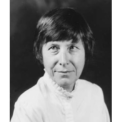

<!--

author: Moritz Riemann
email:  riemann@philsem.uni-kiel.de
version: 0.1
language: en
narrator: UK English Female

\-->

# Judith N. Shklar: Ganz normale Laster

Judith N. Shklar (1928-1992) war eine bedeutende Theoretikerin des politischen Liberalismus und ihr *Liberalismus der Furcht* ist ein vielzitierter Text in der amerikanischen Debatte. Inzwischen liegt ein Großteil ihres umfangreichen Werkes in deutscher Übersetzung vor.
Ihr Buch *Ganz normale Laster* widmet sich dem  Komplementärbegriff zur Tugend.

* Moritz Riemann [riemann@philsem.uni-kiel.de](riemann@philsem.uni-kiel.de) 

* Sprechstundentermine im Sommersemester: **Montags 16:15-17:15 Uhr** |  Boschstraße 1, R. 01.001 | **Keine Anmeldung erforderlich** | Nach Absprache auch digital oder telephonisch unter 0431 880 5644

## "Regierungserklärung"

1. Die Teilnahme am Seminar erfordert die vorbereitende, gründliche Lektüre der Texte.

2. Eine regelmäßige und aktive Teilnahme aller Seminarteilnehmenden ist Voraussetzung für ein gelingendes Seminar.
3. Philosophische Seminare leben vom diskursiven Austausch. Nehmt in Euren Diskussionsbeiträgen auf den Text und aufeinander Bezug, lasst einander ausreden und vermeidet lange, abschweifende Exkurse.
4. Meine Sprechsstunde ist offen für alle Anliegen, es ist keine Anmeldung erforderlich.
5. Bevor Ihr eine Email schreibt: Seht im Seminarplan nach, ob die gesuchte Information dort zu finden ist.

## Semesterplan

| Datum       | Sitzungsprogramm | Protokoll |
|-------------|------------------|-------------------|
| 13.04.2026  | **Einführung und Organisatorisches**                 |          kein Protokoll         |
| 20.04.2026  | 1. Grausamkeit                 |       Protokoll: Hannah Freudendal           |
| 27.04.2026  | 1. Grausamkeit                 | Protokoll:                  |
| 04.05.2026  | 2. Heuchelei                 | Protokoll: Anna Hundertmark   |
| 11.05.2026  | 2. Heuchelei                 | Protokoll:                  |
| 18.05.2026  | 3. Snobismus                 |  Protokoll:                 |
| 25.05.2026  | Pfingstmontag, keine Sitzung                 | kein Protokoll                  |
| 01.06.2026  |  3. Snobismus                | Protokoll:                  |
| 08.06.2026  |  4. Verrat                |  Protokoll:                 |
| 15.06.2026  |  4. Verrat                | Protokoll:                  |
| 22.06.2026  |  5. Misanthropie                |  Protokoll:                 |
| 29.06.2026  | 6. Schlechte Charaktere                 | Protokoll:                  |
| 06.07.2026  | **Abschlussdiskussion, Prüfungsleistungen, Feedback**                 | kein Protokoll                  |

**Prüfungszeitraum des Sommersemesters**:
13.07. - 25.07.2026

**2. Prüfungszeitraum**:
05.10. - 17.10.2026

**Termine für die Anmeldung zum 1. Prüfungszeitraum (1. PZ)**

* Beginn: Montag 01.06.2026
* Ende: Sonntag 26.06.2025

**Termine für die Anmeldung  zum 2. Prüfungszeitraum (2. PZ)**

* Beginn: 24.08.2026
* Ende: 20.09.2026

**Ende des Korrekturzeitraums und Eintragung der Noten**

* 27.11.2026

## Zuordnung und Prüfungsleistungen

* PHF-phil-BA2 (Geschichte der Philosophie – Gegenwart): **Ergebnisprotokoll** im Umfang von 2-3 Seiten. Das Protokoll soll die wesentlichen Inhalte einer Seminarssitzung ergebnisorientiert und systematisch zusammenfassen. Die Anmeldung zum Protokoll erfolgt zu Beginn des Semesters. Es ist bis Freitag, 12 Uhr nach der protokollierten Sitzung in den Dateiformaten **NameVorname-Protokoll-Sitzungsnummer.md** und **NameVorname-Protokoll-Sitzungsnummer.pdf** in den persönlichen OLAT-Teilnehmerordner hochzuladen und dient damit der Rekapitulation zu Beginn der folgenden Sitzung. Beachten Sie die Handreichung zum Erstellen eines Protokolls. Das Protokoll muss am Beginn der folgenden Sitzung kurz (5 Minuten) vorgestellt werden.

* PHF-phil-BA4 (Einführung in die praktische Philosophie): **Take-Home-Klausur** im Umfang von 5-6 Seiten. Die Aufgabenstellung erfolgt in der letzten Sitzung. Abgabe: 30.09.2026

* PHF-phil-BA6 (Praktische Philosophie II – Vertiefung): **Hausarbeit** im Umfang von 10 Textseiten. Individuelle und eigenständige Themenfindung aus dem Themenbereich des Seminars. Ein persönliches Gespräch mit dem Dozenten (Sprechstunde) zur Vorbereitung ist Voraussetzung für die Annahme der Arbeit. Abgabe: 30.09.2026

* PHF-phil-WP (Philosophische Reflexion und ethische Urteilskraft): **Essay** im Umfang von 5-7 Textseiten. Individuelle und eigenständige Themenfindung aus dem Themenbereich des Seminars. Ein persönliches Gespräch mit dem Dozenten (Sprechstunde) zur Vorbereitung ist Voraussetzung für die Annahme der Arbeit. Abgabe: 30.09.2026

Beachten Sie unbedingt die Handreichung zum wissenschaftlichen Arbeiten im Fach Philosophie. Jedes Referat, jede Hausarbeit und jeder Essay sind im Vorfeld in der Sprechstunde abzustimmen. Der Abgabetermin für die schriftlichen Prüfungsleistungen ist der  **30.09.2026**. Die Abgabe von THK, Essays und Hausarbeiten erfolgt als Ausdruck, mit Deckblatt und unterschriebener Eigenständigkeitserklärung an der Hauptpforte oder im Briefkasten für Prüfungsleistungen in der LS4 **sowie** per Email im Format **NameVorname-Modul-Semester.pdf** 

**Eine Abgabe nur per Email ist nicht ausreichend!**

## Hinweise für das Verfassen von Sitzungsprotokollen

### I. Grundformen und Funktionen

1. Wortprotokoll, Verbalprotokoll – direkte Dokumentation des mündlichen Wortlauts z.B. bei Gerichtsverhandlungen
2. Verlaufsprotokoll, Verhandlungsprotokoll – Protokoll des Gesprächsprozesses. Wie kam es zu Beschlüssen oder Ergebnissen? Wie lauteten die Argumente?
3. Ergebnisprotokoll, Beschlussprotokoll – Fokus auf Ergebnisse. Keine Dokumentation des Gesprächsprozesses.
4. Das wissenschaftliche Protokoll – Anteile des Verlauf- und Ergebnisprotokolls. Schriftliche und systematische Wiedergabe diskursiv erarbeiteten Wissens, die eine gemeinsame Wissensbasis schafft. Funktionen: Dokumentation und Aufbereitung des Wissens, Literaturgrundlage, Kontrolle des Wissensstandes, Üben wissenschaftlichen Formulierens

### II. (Sprachliche) Gestaltung

1. Der Protokollkopf: Name der Hochschule, Institut, Seminartyp, Seminarleitung, Protokollant:in, Semester, Datum.

2. Der Protokolltext: 

    * Der Text ist im Präsens und Indikativ zu verfassen. Bei Bezügen auf den Seminarverlauf - also was eine Person sagte - wird Präteritum gewählt. 
    * Das Protokoll ist in ganzen Sätzen (nicht in Stichpunkten) zu formulieren. 
    * Ergebnisse sollen dargestellt werden, allerdings auch deren diskursiver Zusammenhang berücksichtigt werden. Die namentliche Nennung von Sprecher*innen ist nicht angebracht. 
    * Besonders wichtige Aspekte können markiert oder hervorgehoben werden. Auch sollte das Protokoll sinnvoll durch Überschriften und Zwischenüberschriften (Thema und Unterthemen der Sitzung) strukturiert werden. 
    * Übliche Länge sind zwei bis drei DIN-A 4-Seiten.

3. Der Anhang: Bibliographie der Literatur der Seminarsitzung / Folien auf die Bezug genommen wurde.

4. Textformat: Serifenfont (z.B. Times New Roman) 12pt, Fußnoten 10pt., Zeilenabstand 1,5, Blocksatz, Seitenränder 3cm links, 3cm rechts

### III. Herausforderungen

* Balance zwischen diskursivem Verlauf und Ergebnissen -> Herausarbeitung der (zentralen) Ergebnisse.
* Balance zwischen sprachlicher Verknappung/Abstraktion und Wiedergabe der Beiträge. Bitte keine Umgangssprache verwenden. Auf korrekte Fachlexik achten.
* Das Protokoll vor der Abgabe Korrektur lesen (lassen).
* Formal: Protokollkopf einfügen, Gliedern und Strukturieren, Literaturangaben nicht vergessen, Markierungen einheitlich verwenden. (siehe Checkliste)

### IV. Fünf Schritte bei der Erstellung des Protokolls

1. Vorbereitung. Die zu protokollierende Sitzung sollte gut vorbereitet sein.

2. Rezeption der Seminarsitzung. Die anspruchsvolle Aufgabe, Inhalte zu komprimieren und zu strukturieren ist durch eine Tonaufnahme nicht bewältigt, sondern nur vertagt. Außerdem erfordert die Aufnahme das Einverständis des gesamten Plenums. Hören Sie gut zu und seien Sie gnädig mit sich, wenn Sie nicht die vollen 90 Minuten jeden Satz verstehen.

3. Mitschrift während der Sitzung. Wichtige Inhalte müssen dokumentiert werden – gern auch in Stichpunkten oder unter Verwendung von Symbolen und Verweisen. Es ist nicht leicht zu entscheiden, was wichtig und was weniger wichtig ist. Hier hilft es Ihnen, wenn Sie exzellent auf die Seminarsitzung vorbereitet sind. Achten Sie auf folgende Aspekte:

    * Quantität der Besprechungsdauer – Wie lange wurde ein Aspekt besprochen?
    * Top-down denken. Lässt sich die Sitzung in Themenclustern beschreiben? Wie lässt sich eine Struktur herstellen?
    * Gesamtdiskurs aufzeigen. Welche Aspekte vergangener Sitzungen wurden aufgegriffen?
    * Bilanz ziehen. Offene Fragen nennen.

4. Komprimieren und Reproduzieren. Es bietet sich an, die Mitschrift so schnell wie möglich zu bearbeiten, da die Inhalte dann noch frisch erinnert werden. Ergänzen Sie nun aus dem Gedächtnis oder aus Ihren Materialien wichtige Aspekte ihrer Mitschrift und bringen Sie die Inhalte in eine Struktur (die von der Chronologie des Seminars abweichen kann).

5. Erstellen des Protokolls. Die Stichpunkte und Notizen müssen nun in ganze Sätze und eine kohärente Form gebracht werden. Möglicherweise wird der Text auch nochmals umstrukturiert. Der fertige, korrigierte Text kann auch nochmal anhand der Funktionen des Protokolls überprüft werden. Kann eine fremde Person den Sitzungsverlauf und -inhalte nachvollziehen?

Quelle: Kirsten Schindler: Klausur, Protokoll, Essay. Kleine Texte optimal verfassen, Paderborn 2011.

### V. Checkliste vor der Abgabe

 1. Hat Ihr Protokoll einen Kopf?
 2. Ist Ihr Text einheitlich formatiert, im Blocksatz und unter Berücksichtigung der Seitenränder? Stimmen die Seitenumbrüche? Haben Sie Seitenzahlen angegeben?
 3. Haben Sie die Textgrundlage der Sitzung und weitere Quellen einheitlich und eindeutig bibliographisch nachgewiesen?
 4. Besteht Ihr Text aus ganzen und klar verständlichen Sätzen?
 5. Haben Sie Orthographie und Grammatik korrekturgelesen? Haben Sie Fremdwörter und Fachbegriffe nachgeschlagen und deren korrekte Schreibweise überprüft?
 6. Haben Sie die Sitzungsinhalte gegliedert?
 7. Ist Ihr Text ergebnisorientiert verfasst?
 8. Lassen sich die wichtigsten Inhalte der Sitzung anhand Ihres Textes nachvollziehen? Stellen Sie sich vor, Sie müssten einer Kommiliton:in berichten, die bei der Sitzung fehlte.
 9. Bei digitaler Abgabe: Haben Sie Ihr Dokument als .pdf exportiert sowie eine Version im Dateiformat .md erstellt? Einen Überblick über die Markdown-Syntax finden Sie [hier](https://www.markdownguide.org/basic-syntax/).
10. Haben Sie alle Punkte der Checkliste berücksichtigt?
11. Haben Sie Ihr Protokoll auf OLAT in den Abgabeordner geladen?

### VI. Vorstellung des Protokolls in der nächsten Sitzung

* Bereiten Sie Ihr Protokoll so vor, dass Sie zu Beginn der darauffolgenden Sitzung in 5 Minuten die Inhalte der protokollierten Sitzung für die Seminarteilnehmenden zusammenfassen können.
* Sollten Sie in der Sitzung verhindert sein, muss ein neues Protokoll erstellt und vorgestellt werden.

## Der Essay als Prüfungsart in den Bachelor- und Masterstudiengängen Philosophie

### 1. Der philosophische Essay

Mit dem Essay als Prüfungsform stellt sich das Philosophische Seminar der Kieler Universität in eine philosophische Tradition, die in dieser literarischen Form die eigenständige Auseinandersetzung mit
einer Frage und These wagt und einen eigenen Gedanken entfaltet. Der Essay (von frz. *essai*: „Versuch“ >
lat. *exagium*, dt. „wägen“, „Gewicht“) ist ein prägnanter Aufsatz über ein philosophisches Problem, eine
kontrovers diskutierte Fragestellung oder These. Im Unterschied zu einer Hausarbeit, in der eine
sachorientierte und systematische Behandlung eines Themas erwartet wird, kommt es beim Essayschreiben
darauf an, das jeweilige Thema in einem größeren Zusammenhang zu ‚erwägen‘, d.h. zu erörtern, um zu einer eigenen Position zu finden und deutlich Stellung zu beziehen. Der Essay erlaubt stilistisch eine größere Freiheit als die wissenschaftliche Hausarbeit, jedoch handelt es sich nicht um eine persönliche Meinungsäußerung, sondern um eine argumentativ begründete Auseinandersetzung.

Die Tradition des philosophischen Essays geht auf die *Essais* von Michel de Montaigne (1533-1592) zurück und betont die eigene Denkbewegung und das erforschende Suchen eines Standpunktes. Mit der essayistischen Form ist eine besondere Form des Philosophierens verbunden, deren Fokus weniger auf der systematischen Auseinandersetzung liegt, sondern vielmehr in der Darstellung der Denkbewegung und Entfaltung eines Gedankens selbst. Mit Francis Bacon (1561-1626), der das Wort von Montaigne übernommen und ins Englische übertragen hat, wird *Essay* zur Gattungsbezeichnung nicht nur philosophischer, sondern auch literarischer Schriften. Beide Autoren gelten als ´Ahnväter´ der philosophischen Essayistik.

Die semantische Erkundung von *essai/essaier* gibt erste Hinweise auf die Unmittelbarkeit und Erfahrungsorientiertheit der essayistischen Denk- und Schreibweise: Wer essayistisch denkt und schreibt, fängt bei sich, d.h. den eigenen Erfahrungen mit der Welt und mit sich selbst an; sie/er unterzieht dabei die eigenen Sichtweisen, Erfahrungen, Urteile, aber auch das, was an Sichtweisen, Erfahrungen, Urteilen anderer jeweils begegnet, einer denkenden Prüfung oder Erwägung. Wenn es sich bei dem Geschriebenen noch dazu um Versuche handelt, so sind die damit verbundenen Wissens-, Erkenntnis- oder Wahrheitsansprüche anscheinend deutlich herabgestimmt. Zugleich bedeutet die essayistische Denkweise aber auch die Erprobung einer Perspektive auf eine bestimmte Sache (seien es Dinge, Sachverhalte/Phänomene, Situationen, Ereignisse), um sie zu erschließen und zu beurteilen.

Eine Hochzeit der philosophischen Essayistik lag in der europäischen Aufklärung des 18. Jahrhunderts. Die Zeit der kritischen Emanzipation von tradierten Herrschaftsverhältnissen hat namhaften Essayisten wie Voltaire in Frankreich, David Hume in England und Gotthold Ephraim Lessing in Deutschland hervorgebracht.

 
Das Essayschreiben erfordert in besonderer Weise kritisches Selbstdenken und die Entwicklung einer eigenständigen Argumentation. Auch wenn die Rückbeziehung auf persönliche bzw. alltägliche Erfahrungen dabei ein wesentlicher Bestandteil der Essayistik ist, **so liegt im Philosophiestudium der Akzent beim Essayschreiben doch deutlich auf der gedanklichen Auseinandersetzung mit einer philosophischen Problemstellung/Kontroverse oder einer philosophischen Position oder einem philosophischen Begriff.** In diesem Kontext kommt es darauf an, sich philosophische Texte methodisch erschließen zu können, um sie angemessen zu verstehen und auszulegen. Mit Hans Georg Gadamer lässt sich der Vorgang des Verstehens als ein Bemühen beschreiben, mit dem Text ´ins Gespräch zu kommen´, d.h. den historischen Horizont des Textes mit dem eigenen „Verstehenshorizont der Gegenwart“, seinen impliziten Maßstäben und legitimen Vorurteilen zu „verschmelzen“.[^1] Eine gute Vorbereitung für diese **hermeneutische Herangehensweise beim Essayschreiben** ist es, sich vor der Lektüre die eigenen Erwartungen an den Text bzw. an das Thema und das eigene Vorverständnis zu vergegenwärtigen.[^2] Wie bei einem Gespräch mit einem unbekannten Menschen, kann dies dazu beitragen, das Gefühl der Fremdheit zu überwinden und dem Gelesenen gegenüber aufgeschlossen zu bleiben – also: aufmerksam ´zuzuhören´. 

[^1]: H.-G. Gadamer: *Wahrheit und Methode. Grundzüge einer philosophischen Hermeneutik.* Tübingen 1960. 6. Aufl. 1990. S.289f. 

[^2]: Vgl. Thomas Rentsch/Johannes Rohbeck: *Essays schreiben – aber mit Methode.* In: Jahrbuch für Didaktik der Philosophie und Ethik 8 (2007). S. 75-81. hier S.78f.

**Literaturhinweise**

Montaigne, Michel de: *Essais*. Übers. v. Hans Stilett. Frankfurt a.M. 2001.

Bacon, Francis: *Essays oder praktische und moralische Ratschläge*. Übers. v.  Elisabeth Schücking. Hrsg. v. Levin Schücking. Stuttgart 2011.

Konersmann, Ralf: *Essay*. in: Ders.: Wörterbuch der Unruhe. Frankfurt a. M. 2017. S.49-55.

Černy, Lothar: *Essay*, in: Historisches Wörterbuch der Philosophie. Hrsg. v. Joachim Ritter, Karlfried Gründer und Gottfried Gabriel. Basel 1971-2007. Bd. 2, Sp.746-749.

Schärf, Christian: *Geschichte des Essays. Von Montaigne bis Adorno.* Göttingen 1999.

### 2. Der Essay als Prüfungsart in den Bachelor- und Masterstudiengängen Philosophie

Der Essay kann in den BA-Wahlpflichtmodulen BA7 und BA8 als eine unter vier Prüfungsarten gewählt werden (Umfang: ca. 10 Seiten); im Modul BA9 ist er neben einer Hausarbeit als weitere Prüfungsart vorgeschrieben. – In den Masterstudiengängen Philosophie ist der Essay verpflichtende Prüfungsart in den Modulen MAA1 bzw. MAE2. 
Die Form des Essays als Prüfungsleistung ist offener als bei einer Hausarbeit. Zur Form gehören die Zitation und eine Bibliographie, wie es auch die wissenschaftliche Hausarbeit fordert. Jedoch sind strenge Strukturierungen mit einem Inhaltsverzeichnis und einer Kapitelstruktur nicht erforderlich. Selbstverständlich gehört zur Prüfungsleistung des Essays ebenso ein Titelblatt wie die aktuelle Eigenständigkeitserklärung. Die offenere Form liegt in größerer sprachlicher und stilistischer Freiheit. Die eigene Perspektive auf eine philosophische Frage oder einen philosophischen Gedanken darf ausgeführt werden, ohne dabei reine Meinungsäußerung zu sein. Es darf mit Beispielen zur Veranschaulichung und Sprachbildern, Metaphern, Fragen gearbeitet werden. Dabei sollte jedoch eine erkennbare Ordnung der Gedanken, d.h. nachvollziehbare Gedankengänge und die erforderliche logische Konsistenz nicht vernachlässigt werden. Ziel ist es einen Standpunkt zu er- und begründen und eine kritische Reflexion eines philosophischen Gegenstandes vorzunehmen.
Es bestehen verschiedene Möglichkeiten, einen Essay zu verfassen. Jonas Pfister[^3] unterscheidet drei Formen des studentischen Essays: 1) den *kritischen* Essay, der eine kritische Prüfung einer philosophischen These vornimmt; 2) den *problemlösenden* Essay, der die Lösung eines philosophischen Problems versucht, und 3) den *urteilenden* Essay, der die Entscheidung eines philosophischen Streits versucht. Jay F. Rosenberg[^4] erläutert wie in einem Essay eine *begründete Verteidigung einer These* erfolgt.

**Achtung:** Das Thema des Essays ist in der Regel im Rahmen des Seminarhorizonts frei gewählt, aber stets mit den Dozent*innen abzustimmen! Das gleiche gilt für etwaige spezifischen Anforderungen des Essays als Prüfungsleistung, die von der jeweiligen Lehrperson festgelegt werden. Diese können von den hier formulierten Anforderungen abweichen.

**Hinweise zum Essayschreiben** s. Lektion zum Essay im **E-Learning Kurs** *Wissenschaftliches Arbeiten im Fach Philosophie*, 3.6/Lektion 13:

[^3]: Vgl. Pfister, Jonas: *Werkzeuge des Philosophierens*. S.246-250.

[^4]: Vgl. Rosenberg, Jay F.: *Philosophieren. Ein Handbuch für Anfänger*. Frankfurt a. M. 2009. S.81.

## Hinweise zum Verfassen von Hausarbeiten

[Ausführliche Hinweise hier](https://liascript.github.io/course/?https://raw.githubusercontent.com/Philosophie-Lehre-Moritz-Riemann/Hausarbeit/refs/heads/main/Hausarbeit_main.md)

## Judith N. Shklar: Leben und Werk

**Name:** Judith Nisse Shklar  

**Geboren:** 24. September 1928 in Riga, Lettland 

**Gestorben:** 17. September 1992 in Cambridge, Massachusetts, USA  

**Beruf:** Politikwissenschaftlerin und politische Theoretikerin  

Judith Shklar gilt als eine der bedeutendsten liberalen Theoretikerinnen des 20. Jahrhunderts. Ihre Arbeiten haben bis heute Einfluss auf Debatten über politische Ethik, Machtbegrenzung und die Rolle von Freiheit in einer liberalen Gesellschaft.

### Leben

**Herkunft und Flucht:** 
Geboren in eine deutschsprachige jüdische Familie, floh sie 1939 mit ihrer Familie vor den Nationalsozialisten und Sowjets über die Transsibirische Eisenbahn nach Kanada.

**Bildung:** 
Studium der Politikwissenschaft an der McGill University in Montreal; Promotion an der Harvard University (1955). 

**Karriere:**
Erste Frau auf einer Festanstellung im Fachbereich Politische Wissenschaften an der Harvard University. Sie lehrte dort bis zu ihrem Tod und wurde 1980 zur "John Cowles Professor of Government" ernannt.

[**Storymap zu Shklars Flucht und Vita**](https://storymaps.arcgis.com/stories/38af7d5862a84180a00f70f34981df5b)

(Autor:innen: Elaine Ringeloth, Fleming Jensen)

### Philosophisches Denken

**Wichtige Werke**:

- *After Utopia: The Decline of Political Faith* (1957)  
- *Ordinary Vices* (*Ganz normale Laster*, 1984)  
- *The Liberalism of Fear* (*Der Liberalismus der Furcht*, 1989)  
- *Faces of Injustice* (*Über Ungerechtigkeit*, 1990)

**Der Liberalismus der Furcht (1989)**
Dieser kurze Text ist ihr bekanntester und prägendster. Es formuliert eine liberale Theorie, die darauf abzielt, Grausamkeit und Machtmissbrauch zu verhindern. Shklar argumentiert, dass der Liberalismus vor allem die Freiheit sichern sollte, ohne Furcht Entscheidungen treffen zu können. Sie befürwortet eine konstitutionelle, repräsentative und menschenrechtlich-liberale Demokratie, die Macht begrenzt und verteilt.

**Ganz normale Laster (1984)**

In diesem Buch untersucht Shklar alltägliche moralische Schwächen wie Grausamkeit, Heuchelei und Feigheit. Sie stellt Grausamkeit als das größte Übel (*summum malum*) dar und verbindet dies mit ihrer liberalen Theorie. Das Werk bietet eine tiefgehende Reflexion über die moralischen Grundlagen des politischen Handelns.

**Über Ungerechtigkeit (1990)**

In diesem Werk kritisiert Shklar die philosophische Vernachlässigung des Konzepts der Ungerechtigkeit zugunsten von Gerechtigkeitstheorien. Sie analysiert verschiedene Formen von Ungerechtigkeit (z. B. passive und aktive Ungerechtigkeit) und betont deren zentrale Bedeutung für politische und soziale Theorie.

**After Utopia: The Decline of Political Faith (1957)**

Dieses frühe Werk kritisiert utopisches Denken in der politischen Theorie und plädiert für eine realistische Betrachtung politischer Möglichkeiten. Es zeigt Shklars Skepsis gegenüber Ideologien, die auf idealisierten Zukunftsvisionen basieren.

**Essays über Hannah Arendt**

Ihre kritischen Texte über Hannah Arendt beleuchten Unterschiede in den Denkansätzen der beiden Philosophinnen, insbesondere in Bezug auf Exil, Freiheit und politische Romantik. Diese Essays sind besonders relevant für das Verständnis von Shklars Position im Vergleich zu anderen großen politischen Theoretikern[2].
Diese Werke prägen bis heute Debatten über Liberalismus, Gerechtigkeit und politische Ethik und machen Judith Shklar zu einer der bedeutendsten Denkerinnen des 20. Jahrhunderts.

### Zum Nachforschen

#### Ausgewählte Sekundärliteratur

- Abbey, Ruth, „Putting Cruelty First: Exploring Judith Shklar's Liberalism of Fear for Animal Ethics", in: Politics and Animals 2, Nr. 1 (2016), S. 25-36.

- Allen, Jonathan: The Place of Negative Morality in Political Theory, in: Political Theory 29(2001)3, S. 337-363.

-	Bajohr, Hannes und Trimçev, Rieke: [Judith N. Shklar. Leben – Werk – Gegenwart](https://www.beck-shop.de/bajohr-trimev-ad-judith-n-shklar/product/33569982?srsltid=AfmBOooBwTjI0ZacYJTX_RDvWK6Ett0u1E_N57BvUAvT7yYH9MHVY1wX).

- Bajohr, Hannes, „Harmonie und Widerspruch. Mit Judith N. Shklar gegen die ‚Ideologie der Einigkeit*", Hendrikje Schauer und Marcel Lepper (Hg.), Distanzierung und Engagement. Wie politisch sind die Geisteswissenschaften? (Stuttgart: Works & Nights 2018), S.75-85.

- Bajohr, Hannes, „Judith N. Shklar über die Quellen liberaler Normativität", in: Karsten Fischer und Sebastian Huhnholz (Hg.), Liberalismus. Traditionsbestände und Gegenwartskontroversen (Baden-Baden: Nomos 2019), S.71-98.

- Bajohr, Hannes, „Strategies of Authority: The Distorting Think-Piece and the Case of Judith Shklar", in: [Journal of the History of Ideas](https://www.jhiblog.org/2020/07/08/strategies-of-authority-the-distorting-think-piece-and-the-case-of-judith-shklar/) (Blog), 2020.

- Benhabib, Seyla: Judith Shklar's Dystopic Liberalism, *Social Research*, Vol. 61, No. 2 (SUMMER 1994), pp. 477-488.  || Oder auf deutsch: Benhabib, Seyla, „Judith Shklars dystopischer Liberalismus", , in: Judith N. Shklar, Der Liberalismus der Furcht, hg. und übers. Hannes Bajohr (Berlin: Matthes & Seitz 2013), S.67-86.

- Betsky, Celia B., [„Judith Shklar. The Metics' Metic"](https://www.thecrimson.com/article/1972/3/31 judith-shklar-the-metics-metic-pbcbommenting/), The Harvard Crimson, 31. März 1972.

- Blättler, Sidonia: Judith Shklar. Aufklarung ohne Glücksversprechen, in: Polis 53(2011), S. 14-30.

- Davis, Natalie Z., Brief an Judith N. Shklar, 3. Dezember 1982, Papers of Judith N. Shklar, Series: Correspon-dence, 1959-1992, HUGFP 118, Box2.

- Douglass, Robin, ,Cruelty, Injustice, and the Liberalism of Fear", in: Political Theory 51, Nr. 5 (2023), S. 790-813.

- Dunn, John, „Hope over Fear. Judith Shklar as Political Educator", in: Bernard Yack (Hg.), Liberalism without Illusions. Essays on Liberal Theory and the Political Vision of Judith N. Shklar (Chicago: The University of Chicago Press 1996), S. 45-54.

- Flathman, Richard E.: Fraternal, but not Always Sisterly Twins. Negativity and Positivity in Liberal Theory, in: Social Research 66(1999)4, S. 1137-1142.

- Fiser, Webb S., [Rezension zu: Judith N. Shklar, After Utopia], in: Ethics 68, no. 3 [1958), S. 217-219.

- Fives, Allyn: [The unnoticed monism of Judith Shklar’s liberalism of fear](https://journals.sagepub.com/doi/full/10.1177/0191453719849717)- - Allyn Fives: [The unnoticed monism of Judith Shklar’s liberalism of fear](https://journals.sagepub.com/doi/full/10.1177/0191453719849717)

- Forrester, Katrina, „Hope and Memory in the Thought of Judith Shklar", in: Modern Intellectual History 8, Nr. 3 [2011), S. 159.

- Hall, Edward, „Ideological Self-Consciousness: Judith Shklar on Legalism, Liberalism, and the Purposes of Political Theory", in: Social Philosophy & Policy 2024;41(1):105-125. doi:10.1017/S0265052524000347.

- Hess (Hg.), Between Utopia and Realism. The Political Thought of Judith N. Shklar (Philadelphia: University of Pennsylvania Press 2019), S. 239-252.

- Hess, Andreas, The Political Theory of Judith N. Shklar. Exile from Exile (New York: Palgrave Macmillan 2014).

- Hoffmann, Stanley: Judith Shklar as Political Thinker, *Political Theory*, Vol. 21, No. 2 (May, 1993), pp. 172-180.

- Honneth, Axel, „Die Historizität von Furcht und Verletzung. Sozialdemokratische Züge im Denken von Judith Shklar", in: ders., Vivisektionen eines Zeitalters. Porträts zur Ideengeschichte des 20. Jahrhunderts (Berlin: Suhrkamp 2014), S. 248-262.

- Ignatieff, Michael, [Rezension zu: Judith N. Shklar, Ordinary Vices], in: The Political Quarterly 56, Nr. 3 [1985), S. 309-312.

- Levinson, Sanford, „Is Liberal Nationalism an Oxymoron? An Essay for Judith Shklar" S. 626-645.

- Memorial Tributes to Judith Nisse Shklar, 1928-1992. A Service in Memory of Judith Nisse Shklar, Cowles Professor of Government, Harvard University, 24 September 1928-17 September 1992. The Memorial Church, Harvard University, Friday, 6 November 1992 (Cambridge, Mass. 1992).

- Misra, Shefali, „Ugly Attachments: Judith Shklar and the Unattractive Face of Solidarity", in: Global Intellectual History 7, Nr. 4 [2022): S. 685-701.

- Moyn, Samuel, „Before - and Beyond - the Liberalism of Fear", in: Samantha Ashenden und Andreas Hess (Hg.), Between Utopia and Realism. The Political Thought of Judith N. Shklar (Philadelphia: University of Pennsylvania Press 2019), S. 24-46.

- Moyn, Samuel, „Judith Shklar über die Philosophie des Völkerstrafrechts", , in: Deutsche Zeitschrift für Philosophie 62, Nr. 4 [2014), S. 683-707.

- Müller, Jan-Werner, Furcht und Freiheit. Für einen anderen Liberalismus (Berlin: Suhrkamp 2019).

- Pickford, Eleanor: [Judith Shklar on the problem of political motivation](https://www.repository.cam.ac.uk/items/cbfac99e-182f-435e-b46e-b25755c0c65f) 

- Sabl, Andrew, „Judith Shklar, Ordinary Vices, in: Jacob T. Levy [Hg.), The Oxford Handbook of Classics in Con-temporary Political Theory [Oxford: Oxford University Press 2019), https://doi.org/10.1093/oxfordhb/9780198717133.013.5.

- Salaverría, Heidi, „Ungeregelte Zweifel und politische Urteilsbildung bei Judith Shklar und Jacques Rancière", in: Deutsche Zeitschrift für Philosophie 62, Nr. 4 [2014), S. 708-726.

- Ulrich, Amadeus, „Furcht und Elend in der Demokratie. Zur Aktualität des politischen Denkens von Judith N. Shklar", , in: Zeitschrift für Politische Theorie 13, Nr. 1-2 [2023), S. 69-89.

- Unrau, Christine, „Judith Shklars Sinn für Veränderung", in: Zeitschrift für Politische Theorie 9, Nr. 2 [2018[2020]), S. 239-251.

- Voigt, Peter, „Skepsis und Sozialdemokratie - Mésalliance oder Zukunftsbündnis? Ein Plädoyer im Anschluss an Judith Shklar", in: Zeitschrift für Politische Theorie 9, Nr. 2 [2018 [2020]), S. 223-238.

- Walzer, Michael, „Über negative Politik", in: Shklar, Der Liberalismus der Furcht, S. 87-105.

- Wolin, Sheldon S., [Rezension zu: Judith N. Shklar, After Utopia], in: Natural Law Forum 5 [1960), S. 163-177.

-	Zeitschrift für Theoretische Philosophie:[Themenheft zur Shklars politischer Philosophie][hhttps://shop.budrich.de/wp-content/uploads/2022/01/1869-3016-2018-2.pdf).

- Rieke Trimçev: [Verbindlichkeitskonflikte und politische Verpflichtung][https://www.ssoar.info/ssoar/bitstream/handle/document/66276/ssoar-zpth-2018-2-trimcev-Verbindlichkeitskonflikte_und_politische_Verpflichtung.pdf?sequence=2&isAllowed=y&lnkname=ssoar-zpth-2018-2-trimcev-Verbindlichkeitskonflikte_und_politische_Verpflichtung.pdf).

#### Judith Shklar im Netz [Auswahl)

-	[Die politische Philosophie der Judith N. Shklar - Liberalismus ohne Illusionen][https://www.br.de/mediathek/podcast/radiowissen/die-politische-philosophie-der-judith-n-shklar-liberalismus-ohne-illusionen/1853684).

-	[Judith N. Shklar: „Über Hannah Arendt“. Kritik unter Geistesgrößen][https://www.deutschlandfunkkultur.de/judith-n-shklar-ueber-hannah-arendt-kritik-unter-100.html).

- [Buchkritik von H. Bajohr][https://www.deutschlandfunkkultur.debuchkritik-ad-judith-n-shklar-von-hannes-bajohr-rieke-trimcev-dlf-kultur-6782831d-100.html).

- [Literaturkritik: Nora Ecker - Wir schauen zu gerne weg][https://literaturkritik.de/shklar-ueber-ungerechtigkeit,28533.html).

- [MacArthur Foundation: Judith N. Shklar][https://www.macfound.org/fellows/class-of-march-1984/judith-n-shklar).

- [Seyla Benhabib:Judith Nisse Shklar][https://bpb-us-w2.wpmucdn.com/campuspress.yale.edu/dist/3/949/files/2016/05/Judith-Nisse-Shklar-1928-1992-Proceedings-of-the-APA-1vyo0j1.pdf).

- [Bunk:Judith N. Shklar][https://www.bunkhistory.org/tags/persons/judith-n-shklar).

- [Alexander Cammann[Zeit Online): Judith Shklar. Triumph einer Außenseiterin][https://www.zeit.de/2017/27/judith-nisse-shklar-philosophin-liberalismus-sammelband).

- [Katharina Kaufmann [Theorieblog): Dialog zwischen einer Exilantin und einem Staatsbürger – Lesenotiz zu Judith Shklar über „Verpflichtung, Loyalität, Exil“][https://www.theorieblog.de/index.php/2019/12/dialog-zwischen-einer-exilantin-und-einem-staatsbuerger-lesenotiz-zu-judith-shklar-ueber-verpflichtung-loyalitaet-exil/).

- [Dr. Sandra von Siebenthal:Judith Shklar: Liberalismus der Furcht [Rezension)][https://denkzeiten.com/2023/06/26/judith-shklar-liberalismus-der-furcht/).

- [Wikipedia: Judith Shklar][https://de.wikipedia.org/wiki/Judith_N._Shklar).

- [Michael Knoll [intellectures): Liberalismus und Demokratie führen eine Zweckehe][https://www.intellectures.de/2021/03/29/liberalismus-und-demokratie-fuehren-eine-zweckehe/).

#### Podcastsendungen [Auswahl)

-	[Podcast Filosofie: Judith Shklar][https://podcasts.apple.com/de/podcast/judith-shklar/id1451841760?i=1000646349383).

-	[Required Reading from: Liberalism of Fear by Judith Shklar][https://podcasts.apple.com/de/podcast/liberalism-of-fear-by-judith-shklar/id1786599014?i=1000681133134).

-	[SWR. Das Wissen: Die Politologin Judith Shklar][https://podcasts.apple.com/de/podcast/die-politologin-judith-nisse-shklar-wie-demokratien/id104913043?i=1000501341831).

-	[Talking Politics: Shklar on Hypocrisy](https://podcasts.apple.com/de/podcast/shklar-on-hypocrisy/id1508992867?i=1000517869772).

## 2. Sitzung am 20.04.2026

### Protokoll von Hannah Freudendahl

**Gegenstand und Ziel der Sitzung**

Die zweite Sitzung stellte die erste Textsitzung dar und widmete sich der gemeinsamen

Erarbeitung des ersten Teils von Judith N. Shklars Werk Ganz normale Laster. Im Mittelpunkt stand die Frage, wie Grausamkeit als philosophischer Gegenstand eingeführt wird und warum sie eine zentrale Rolle einnimmt. Behandelt wurden insbesondere die Kapitel zur Priorisierung der Grausamkeit sowie ihr Verhältnis zur christlichen Praxis und zur Rolle der Opfer.

**Lasterbegriff und Einordnung der Grausamkeit**

Zu Beginn wurde der Begriff des Lasters geklärt. Laster wurden als Gegenstücke zu

Tugenden verstanden und als negative Charaktereigenschaften beschrieben, die im Alltag wirksam sind. Dabei wurde betont, dass Laster — ähnlich wie Tugenden — erlernt und durch soziale Umstände geprägt werden können. Sie sind somit Teil der menschlichen Natur und müssen als solche betrachtet werden.

Grausamkeit wurde als ein zentrales Laster hervorgehoben, das sowohl individuell als auch gesellschaftlich relevant ist. Gleichzeitig wurde deutlich, dass es sich nicht um eine rein theologisch bestimmte Kategorie handelt, sondern um ein alltägliches Phänomen, das unabhängig von religiösen Deutungen analysiert werden kann.

**Begriff und Struktur der Grausamkeit**

Die Bestimmung von Grausamkeit erfolgte über ihre Wirkung: Grausamkeit bedeutet, einem anderen Wesen willentlich Leid zuzufügen, sei es körperlich oder psychisch. Dabei wurde herausgestellt, dass Grausamkeit und Gewalt nicht klar voneinander getrennt werden können, da Grausamkeit häufig als spezifische Form oder Bestandteil von Gewalt erscheint. Zugleich wurde betont, dass Grausamkeit ein wiederkehrendes Handlungsmuster ist, an das sich Menschen gewöhnen können. Diese Gewöhnung führt dazu, dass Grausamkeit sowohl im privaten als auch im politischen Kontext normalisiert wird.

**Die Priorisierung der Grausamkeit**

Ein zentraler Punkt der Sitzung war die These, Grausamkeit „an erste Stelle" zu setzen.[^1] Dies bedeutet, Grausamkeit als größtes Übel zu begreifen, das unbedingt vermieden werden muss. Diese negative Primatsetzung steht im Gegensatz zu klassischen ethischen Modellen, die ein höchstes Gut definieren. Die Priorisierung der Grausamkeit impliziert zudem eine Verschiebung moralischer Maßstäbe: Statt Handlungen in Bezug auf göttliche Ordnung zu bewerten, werden sie als zwischenmenschliche Handlungen beurteilt. Dadurch wird Grausamkeit als eigenständiges moralisches Problem sichtbar.

**Grausamkeit im historischen und religiösen Kontext**

Im weiteren Verlauf wurde das Verhältnis von Grausamkeit und christlicher Praxis diskutiert. Dabei zeigte sich, dass Grausamkeit historisch häufig religiös legitimiert wurde, etwa durch Vorstellungen von Strafe, göttlicher Gerechtigkeit oder Märtyrertum. Besonders hervorgehoben wurde, dass Grausamkeit in religiösen Kontexten nicht grundsätzlich abgelehnt, sondern teilweise als sinnvoll oder notwendig interpretiert wurde.[^2] Dies zeigt sich beispielsweise in der Verbindung von Folter und Wahrheitsermittlung oder in der Idee der Reinigung durch Leiden.

**Machiavellismus, Selbstbetrug und Rechtfertigung**

Ein weiterer Schwerpunkt lag auf der Frage, warum Grausamkeit trotz ihrer moralischen

Problematik praktiziert wird. Hier wurde der Zusammenhang von Grausamkeit, Selbstbetrug und Heuchelei herausgestellt. Es wurde deutlich, dass Menschen grausame Handlungen häufig durch narrative Konstruktionen rechtfertigen oder verschleiern. Dadurch wird Grausamkeit nicht mehr als solche wahrgenommen. Besonders anschaulich wurde dies am Beispiel Usbek gezeigt, der seine Grausamkeit als Ausdruck von Liebe interpretiert.[^3]

Zugleich wurde Machiavellis Position diskutiert, nach der Grausamkeit ein effektives Mittel zur Sicherung von Macht und Gehorsam darstellt. Er rechtfertigt die Grausamkeit nicht. Es geht nur darum, was ihm als Fürst was bringt. Grausamkeit erscheint hier als „leichteres Mittel", um Gehorsamkeit zu erlangen.[^4]

**Die Rolle der Opfer**

Abschließend wurde die Rolle der Opfer von Grausamkeit thematisiert. Dabei wurde betont, dass eine Idealisierung oder Heroisierung der Opfer problematisch ist, da sie die Gewalt der Täter relativieren kann. In der Diskussion wurde deutlich, dass Opfer oft in sehr schwierigen und ausweglosen Situationen stehen und ihr Verhalten stark davon geprägt ist.[^5] Außerdem wurde hervorgehoben, dass die Zuschreibung positiver Eigenschaften wie Mut oder Stolz problematisch sein kann, weil dadurch die Grausamkeit in den Hintergrund tritt. Der Fokus verschiebt sich dann von der eigentlichen Gewalthandlung hin zur Reaktion der Betroffenen.[^6]

**Fazit**

Die Sitzung zeigte, dass Shklar mit der Fokussierung auf Grausamkeit einen eigenen Zugang zur Moralphilosophie entwickelt. Anstatt ein höchstes Gut in den Mittelpunkt zu stellen, geht es ihr vor allem darum, Grausamkeit als größtes Übel zu erkennen und zu vermeiden. Dabei wurde deutlich, dass Grausamkeit kein Ausnahmephänomen ist, sondern im Alltag ebenso wie im politischen Kontext eine Rolle spielt und durch Gewöhnung sowie verschiedene Formen der Rechtfertigung aufrechterhalten wird.

Für die nächste Sitzung bleibt damit insbesondere die Frage offen, wie diese

Mechanismen genauer zu verstehen sind und welche Rolle dabei weiterhin die

Perspektive der Opfer spielt. Darauf aufbauend wird die Diskussion im weiteren Verlauf des Textes fortgesetzt.

Literaturhinweis: Shklar, Judith N.: Ganz normale Laster. Berlin: Matthes & Seitz, 2014.

[^1]: Vgl. Judith. N. Shklar: Ganz normale Laster. Berin: Matthes & Seitz 2014, S. 15.
    
[^2]:  Vgl. Judith N. Shklar: Ganz normale Laster, S. 16f. 
    
[^3]:  Vgl. Judith N. Shklar: Ganz normale Laster, S. 21.
    
[^4]:  Vgl. Judith N. Shklar: Ganz normale Laster, S. 18. 
    
[^5]:  S. 19. 
   
[^6]:  S. 24ff.

## 3. Sitzung am 27.04.2026

### Protokoll von Lucas Adutwum

**Thema der Sitzung**

Grausamkeit und Opfer in Judith N. Shklars Ganz normale Laster

**1. Begrüßung und Rückblick**

Zu Beginn der Sitzung wurde an die vorherige Sitzung angeknüpft. Im Mittelpunkt stand erneut die Frage, wie Judith N. Shklar den Begriff der Grausamkeit bestimmt und warum sie Grausamkeit als größtes Laster versteht. Dabei wurde festgehalten, dass Grausamkeit nicht einfach mit Gewalt gleichzusetzen ist. Gewalt kann in bestimmten historischen, politischen oder religiösen Kontexten legitimiert werden; Grausamkeit dagegen entzieht sich einer solchen Rechtfertigung.

**2. Warum Grausamkeit an erster Stelle steht**

Ein zentrales Thema der letzten Sitzung war die Frage, weshalb Shklar Grausamkeit an die erste Stelle der Laster setzt. In der Diskussion wurde deutlich, dass damit eine Verschiebung gegenüber religiösen Moralsystemen verbunden ist. Während dort etwa Stolz als Todsünde gilt, steht bei Shklar nicht die Verletzung einer göttlichen Ordnung im Vordergrund, sondern das konkret verursachte menschliche Leid.

Stolz kann zwar mit Grausamkeit verbunden sein, ist aber nicht unbedingt deren Ursache und kann daher nicht als oberstes Laster gelten. Grausamkeit tritt gerade dadurch hervor, dass sie keine tragfähige Legitimierung besitzt. Sie kann nicht mit Verweis auf Religion, Tugend, Erziehung, Politik oder ein höheres Ziel gerechtfertigt werden. Historische Beispiele – etwa Gewalt im Namen des Christentums – zeigen, dass solche Rechtfertigungen häufig eher Formen der Selbsttäuschung darstellen als echte Begründungen.

**3. Zwischenergebnis: Grausamkeit an erster Stelle**

Die Sitzung arbeitete heraus, dass „Grausamkeit an erste Stelle setzen“ nicht bedeutet, einzelne grausame Handlungen in eine Rangordnung zu bringen. Es geht also nicht darum, abstrakt zu entscheiden, welche Handlung „schlimmer“ ist. Vielmehr bedeutet es, menschliches Verhalten grundsätzlich unter dem Gesichtspunkt zu betrachten, dass Grausamkeit unbedingt vermieden werden muss.

**4. Opfer-Thematik: Was ist ein Opfer? (ab S. 24)**

Im zweiten Teil der Sitzung wurde die Opfer-Thematik behandelt. Ausgangspunkt war die Frage, was es bedeutet, jemanden als Opfer zu bezeichnen. Dabei zeigte sich ein grundlegender Zwiespalt: Wenn Menschen ausschließlich als Opfer erscheinen, droht ihnen ihre Individualität und damit ein Teil ihrer Menschlichkeit genommen zu werden. Sie erscheinen dann als völlig machtlos, fast wie Objekte, denen jede Handlungsmöglichkeit abgesprochen wird.

Gleichzeitig ist es problematisch, Opfern Verantwortung zuzuschreiben. Denn wenn man ihnen Handlungsmöglichkeiten unterstellt, kann der Eindruck entstehen, sie seien für ihr Leiden mitverantwortlich.

Es wurde festgehalten, dass grundsätzlich jeder Mensch Opfer werden kann. Opfersein ist keine feste Eigenschaft, sondern eine mögliche Situation.

**5. Individualität, Namenlosigkeit und Heroisierung**

Ein weiterer Schwerpunkt lag auf der Frage, warum manche Opfer erinnert und benannt werden, während andere in einer anonymen Masse verschwinden. Am Beispiel Roxana wurde diskutiert, dass sie ebenso Opfer von Usbek ist wie andere Figuren, die weniger sichtbar bleiben. Daraus ergab sich die Frage, ob Opfer „mehr Opfer“ sind, nur weil sie genannt oder literarisch hervorgehoben werden.

Die Sitzung hielt fest, dass Opfersein häufig zur Gruppierung führt. Dadurch kann Individualität verloren gehen: Aus einzelnen Menschen werden „namenlose Opfer“, wodurch ihre Menschlichkeit erneut bedroht wird.

**6. Täter, Verantwortung und Handlungsmacht**

Im weiteren Verlauf wurde diskutiert, ob Shklar sich zu stark auf die Opferperspektive konzentriert und die Täter dadurch zu wenig berücksichtigt werden. Dabei wurde herausgearbeitet, dass Opfer – in Anlehnung an Jean-Paul Sartre – erst durch Täter geschaffen werden: Ohne Täter gibt es keine Opferrolle (S. 28).

Zugleich wurde deutlich, dass Verantwortung und Handlungsmacht eng zusammenhängen. Wenn alle Verantwortung ausschließlich dem Täter zugeschrieben wird, kann das Opfer als völlig machtlos erscheinen und damit erneut entmenschlicht werden. Wird dem Opfer hingegen Verantwortung zugeschrieben, entsteht die Gefahr, ihm Handlungsmöglichkeiten zu unterstellen und damit eine Mitschuld an seinem Leiden zu implizieren.

**7. Tapferkeit, Mut, Feigheit und Grausamkeit**

Abschließend wurde die Rolle von Tapferkeit und Feigheit diskutiert. Tapferkeit kann nicht einfach als Gegenbegriff zur Grausamkeit gelten, da auch Täter sich selbst als mutig oder tapfer darstellen können.

Besonders problematisch ist, dass Opfern nicht nur nachträglich heroische Eigenschaften zugeschrieben werden, sondern dass von ihnen Tapferkeit teilweise sogar erwartet wird (S. 29). Diese Erwartung ist fragwürdig, da Opfer nicht freiwillig in ihre Lage geraten.

**8. Abschluss und Ergebnis der Sitzung**

Als zentrales Ergebnis wurde festgehalten, dass Grausamkeit bei Shklar keine legitimierende Grundlage besitzt. Sie kann weder religiös noch politisch noch moralisch gerechtfertigt werden. Zudem besitzt sie kein positives Gegenstück wie Tapferkeit oder Mut, das als erstrebenswerte Tugend gelten könnte.

**Literatur**

Shklar, Judith N.: *Ganz normale Laster*. Berlin 2014 (Original: *Ordinary Vices*, 1984).

## 4. Sitzung am 4.5.2026

**Bildet 4 Gruppen**

Beantwortet in der Gruppenarbeit folgende Fragen mit den Seiten 57-81

1. Wie charakterisiert Shklar den Begriff der Heuchelei?
2. Was bedeutet es, Heuchelei an erste Stelle zu setzen im Vergleich dazu, Grausamkeit an erste Stelle zu setzen?
3. Wie beschreibt sie das Verhältnis von Heuchelei und Aufrichtigkeit?
4. Sammelt pro Gruppe 2-3 Textstellen (ca. 1 Seite), die wir im Plenum lesen und diskutieren.

### Protokoll von Anna Hundertmark

**Sitzung am 04.05.: Einführung in das Kapitel _Seien wir keine Heuchler_**

**Rückblick auf die Grausamkeit:**

Die Sitzung wird eröffnet, indem die Protokolle zu den beiden vorangegangenen Sitzungen präsentiert werden:

Das Protokoll zur ersten Sitzung blickte zunächst auf die Grausamkeit als zentrales Laster und alltägliches Phänomen zurück. Es wurde die Bedeutung des absichtlichen Zufügens von Leid als wiederkehrendes Handlungsmuster thematisiert und verdeutlicht, wie dieses durch wiederkehrende Handlungsmuster einen Normalisierungseffekt erzielt. Im Anschluss daran wurde gezeigt, dass die Priorisierung der Grausamkeit diese Zusammenhänge problematisiert. Außerdem wurde der Zusammenhang von Grausamkeit und Gewalt aufgegriffen und zusammengefasst, wie dieser unter anderem im Kontext Machiavellis Grausamkeit als Mittel für Gehorsam legitimiert. Es wurden bereits Bezüge zu den Folgesitzungen angedeutet, indem dargestellt wurde, dass die positive Konnotation der Opfer von der Grausamkeit ablenkt und der Selbstbetrug im Kontext der Grausamkeit einen ersten Bezug zur Heuchelei herstellt.

Im zweiten Protokoll wurden die Erkenntnisse zur Problematik im Umgang mit den Opfern von Grausamkeit stärker fokussiert. Anschließend an die erste Sitzung wurde vertieft, dass das Feiern der Opfer von Gewalt und Grausamkeit zur Legitimation dieser führt. Ein weiteres Problem wurde darin gesehen, dass die Individualität der Opfer in der Masse der Opfer untergeht. Abschließend wurde festgestellt, dass eine komplementäre Tugend zur Grausamkeit fehlt, da die gängigen Tugenden, die ihr gegenübergestellt werden, wie Stolz oder Tapferkeit, unmittelbar an die Grausamkeit anschließen und ohne sie nicht bestehen können.

**Abschließende Gedanken zur Grausamkeit:**

Bevor im zweiten Kapitel zum Thema der Heuchelei übergegangen wird, wird der Rückblick durch eine kurze Betrachtung des letzten Abschnitts des ersten Kapitels abgeschlossen. Zunächst wird etabliert, dass die Idee Montaignes, die Grausamkeit wie bisher besprochen an erste Stelle zu setzen, an ihre Grenzen stoßen kann, da dies zu Misanthropie führen kann. Dabei wird jedoch die Existenz der Nicht-Grausamen und die eigene Grausamkeit übergangen, was zu Heuchelei führt. Hieraus ergibt sich die Frage nach der moralischen Grausamkeit, wobei ein besonderes Augenmerk auf Nietzsche und dessen Idee, die Heuchelei an erste Stelle zu setzen, da sie die Grausamkeit der Menschen verschleiert, gelegt wird. Hier zeigt sich erneut die Schwierigkeit der Abgrenzung von Grausamkeit und Gewalt und es wird deutlich, dass die Heuchelei ein Problem mit zwischenmenschlicher und politischer Dimension darstellt.

**Seien wir keine Heuchler:**

Im Rahmen einer Gruppenarbeit werden drei Fragen und eine Aufgabe bearbeitet und anschließend im Plenum besprochen. Die Fragen werden mithilfe des ersten Teils des zweiten Kapitels bearbeitet. Die Bearbeitung der Aufgabe, zwei bis drei Textstellen zu sammeln, die im Plenum gelesen und diskutiert werden sollen, wird in die Besprechung der drei Fragen integriert und daher nicht gesondert protokolliert.

**Wie charakterisiert Shklar den Begriff Heuchelei?**

Es wurde dargestellt, wie Shklar den Begriff der Heuchelei anhand des zugehörigen Eintrags im Oxford Dictionary als „unter der Verschleierung, des wahren Charakters oder der tatsächlichen Neigung eine falsche Erscheinung von Tugend oder Güte annehmen, vor allem in Bezug auf den Glauben oder religiöses Leben" (S. 59) definiert. Hieraus ergab sich eine Profilierung der sich heilig verhaltenden Person, was hehre Ansprüche an diese erhob. Das Erkennen von Heuchelei war in der Konsequenz abhängig vom Moralverständnis der Person, die versuchte sie zu entlarven und es stellte sich die Frage nach den sich aus einer Entlarvung ergebenden Konsequenzen.

Die gesammelten Ergebnisse wurden um den Selbstbetrug ergänzt, welcher die Konsequenz der hohen Ansprüche einer streng Gläubigen Person sein muss und die Verbreitung der Heuchelei im religiösen Kontext unterstreicht (S. 61).

**Was bedeutet es, Heuchelei an erste Stelle zu setzen im Vergleich dazu, Grausamkeit an erste Stelle zu setzen?**

Grausamkeit wurde definiert als Handlungen, die direktes Leid nach sich ziehen, wogegen gezeigt wurde, dass Heuchelei nicht zwingend zu Leid führt. Weiterhin wurde gezeigt, dass Grausamkeit Taten voraussetzt, während die Heuchelei den Fokus auf die Ideologie legt, nach der gehandelt wird. Zudem wurde festgestellt, dass Shklar, „den Heuchler" als Charakter in der Tradition hellenistischer Charakterisierungen etabliert (S. 61), während Grausamkeit keine Charaktereigenschaft darstellt, die es erlaubt, „den Grausamen" zu etablieren.

**Wie beschreibt sie das Verhältnis von Heuchelei und Aufrichtigkeit?**

Es wurde deutlich, dass laut Shklar Aufrichtigkeit und Heuchelei nicht ohneeinander funktionieren können (S. 72). Hier wurde zwischen „alten Heuchlern" und „neuen Heuchlern" unterschieden: Während die ersteren ein schlechtes Gewissen entwickelten und schlechte Taten verheimlichten, verteidigten die letzteren ihr Verhalten und justierten ihr Gewissen selbst, ohne dass die Gesellschaft Einfluss nimmt. Dadurch wird die Geisteshaltung, die die Abgrenzung von Heuchelei und Aufrichtigkeit ermöglicht, durch das Individuum selbst vorgenommen. Dies verschärfte die Problematik der subjektivistischen Doktrin. Hieraus ergab sich Folgendes. Am Beispiel von Alceste konnte gezeigt werden, dass Aufrichtigkeit nicht bedeuten kann, jedem zu sagen, was man denkt, da dies kein gesellschaftlich kompatibles Verhalten sein kann, wenn die Gesellschaft Heuchelei voraussetzt (S. 65).

**Literatur:**

Shklar, Judith N.: _Ganz normale Laster_. Berlin 2014 (Original: _Ordinary Vices_, 1984).

